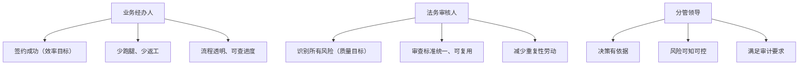
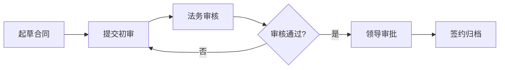
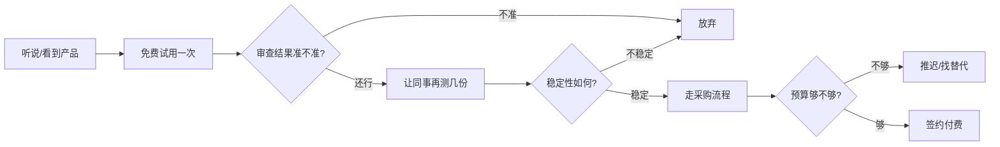

# 用户研究文档

> 文档状态：初稿 | 最后更新：2026-05-27

---

## 1. 研究背景与方法

### 1.1 研究目的

本研究的核心目标：明确 AI 合同审查助手的目标用户群体，深入理解各角色在合同审查场景中的工作任务、痛点与需求，为产品设计提供用户视角的决策依据。

### 1.2 研究方法

本次研究综合采用以下方法：

| 方法 | 目的 |
|------|------|
| 二手资料分析 | 收集政府合同管理公开报告、审计通报、改革案例 |
| 竞品用户评价分析 | 分析现有法律科技产品的用户反馈 |
| 角色建模 | 基于职责分工构建典型用户角色 |
| 场景分析法 | 还原典型工作场景中的任务流与痛点 |

> **数据来源说明**：本研究引用的案例和数据均来自 2024-2025 年各级政府公开的改革实践报告及权威媒体报道，详见文末参考文献。

---

## 2. 用户角色分析

在政府/事业单位的合同审查场景中，共涉及三类核心角色和一个外围角色：

### 2.1 业务经办人（发起者）

| 维度 | 描述 |
|------|------|
| 典型职位 | 采购专员、项目负责人、科室经办人 |
| 核心职责 | 发起合同签署流程、准备合同材料、跟进审批进度 |
| 系统使用 | 常用 OA 系统、政府采购平台 |
| 技术能力 | 基础办公软件操作，AI 工具使用经验有限 |
| 人数占比 | 约 60%（最大用户群体） |
| 关键诉求 | **快**——不想在合同流程上耗费时间，希望尽快完成签约 |

### 2.2 法务/法规科审核人（审核者）

| 维度 | 描述 |
|------|------|
| 典型职位 | 法规科科员/科长、外聘法律顾问 |
| 核心职责 | 合同合法性审查、风险识别与提示、条款修改建议 |
| 系统使用 | 法律数据库（北大法宝）、办公软件 |
| 技术能力 | 专业能力强的同时，对新工具保持审慎态度 |
| 人数占比 | 约 15%（专业壁垒最高的群体） |
| 关键诉求 | **准**——审查结果须准确可靠，不能承担误判责任 |

### 2.3 分管领导（决策者）

| 维度 | 描述 |
|------|------|
| 典型职位 | 分管副局长/副主任、办公室主任 |
| 核心职责 | 最终审批签署、对合同合规性负总责 |
| 系统使用 | 移动端审批为主 |
| 技术能力 | 对具体操作不关注，关注结果和风险 |
| 人数占比 | 约 10% |
| 关键诉求 | **可控**——全流程可视、风险一目了然、审计可追溯 |

### 2.4 审计/纪检部门（外围监督者）

| 维度 | 描述 |
|------|------|
| 典型职位 | 审计科员、纪检组工作人员 |
| 核心职责 | 事后监督、合同合规性抽查、问题追责 |
| 关键诉求 | **可溯**——合同审查全流程留痕，审计时能快速调取 |

---

## 3. 用户目标与任务分析

### 3.1 各角色的核心目标

### 3.2 典型任务拆解

#### 业务经办人：一份采购合同的完整流程

每个环节的痛点：

| 环节 | 耗时 | 典型问题 |
|------|------|---------|
| 起草合同 | 0.5-1 天 | 找不到合适的合同模板，参考历史合同需翻找 |
| 提交初审 | 0.5 天 | 材料不齐被退回（陕西师大案例：50%+ 合同因材料不符被退回[^4]） |
| 法务审核 | 1-3 天 | 排队等待，反复修改，沟通成本高 |
| 领导审批 | 0.5-2 天 | 领导出差、审批积压 |
| **合计** | **2.5-7 天** | **其中法务审核环节占时最长** |

---

## 4. 深度痛点分析

### 4.1 痛点全景图

基于多地政府合同管理调研报告，将痛点按"频率×影响程度"分类：

| 象限 | 痛点 | 典型案例 |
|------|------|---------|
| **高频·高影响** 🔴 | 合同条款风险人工排查遗漏 | 德州清查发现程序不严谨、内容有缺陷等突出问题[^6] |
| **高频·高影响** 🔴 | 多轮修改沟通成本高 | 传统合同流转流程多达 32 项[^1] |
| **高频·高影响** 🔴 | 审查标准不一致，结果因人而异 | 不同法务/律师审查尺度不一 |
| **高频·中影响** 🟡 | 合同材料反复被退回 | 高校案例：50%+ 合同因材料不符被退回[^4] |
| **中频·高影响** 🔴 | 合同履约监管缺失 | "新官不理旧账"问题在多地调研中反复出现[^1][^3] |
| **中频·中影响** 🟡 | 审计时合同档案难以快速调取 | 合同信息分散，缺乏统一归集[^3] |
| **低频·高影响** 🔴 | 出现重大合同纠纷后被追责 | 合同风险问题数据库建设滞后[^3] |

### 4.2 场景化痛点还原

#### 场景一：经办人的"返工循环"

> "一份 5 万元的设备采购合同，因为预算科目填写不规范，被退回修改了 3 次。每次都要重新找领导签字，跑了 4 趟才搞定。"——某事业单位采购专员

**效率损失**：陕西师范大学实践数据显示，2024 年小额零星采购合同超半数因文件审核不通过被退回修改[^4]。河南济源改革前项目平均签约周期为 15 天[^5]。

#### 场景二：法务的"重复劳动"

> "每天看七八份合同，90% 的条款都是重复的。但必须逐条审，因为出一次错就要担责。月底审计检查时还要翻出来重新对一遍。"——某区法规科科员

**效率瓶颈**：威海市实践表明，覆盖 356 家单位的合同审查工作，需要系统性标准化审查体系支撑，否则靠人海战术不可持续[^3]。

#### 场景三：领导的"信息黑箱"

> "合同在哪个环节了？有没有风险？只能打电话问下面的人。审计来查的时候，要翻半天档案才能找到对应的审批记录。"——某单位分管领导

**管理盲区**：大足区改革前同样面临合同签订后无人跟踪履约的困境，"新官不理旧账"是政府合同管理中的顽疾[^1]。

---

## 5. 用户画像

### 5.1 画像一：张主任（法务审核人）

| 维度 | 描述 |
|------|------|
| 基本信息 | 男，45 岁，某区教育局法规科科长，法律专业背景 |
| 工作日常 | 每天审核 5-8 份合同，涵盖采购、服务、租赁等类型 |
| 技术习惯 | 熟练使用办公软件，对 AI 工具有了解但持保留态度 |
| 核心痛点 | • 合同量大，人手不足 • 个别合同条款专业性强（如 IT 采购），超出个人知识范围 • 担心 AI 审查结果不可靠，出问题要自己担责 |
| 期望 | • AI 能先做一轮筛查，标明风险等级和依据 • 审查结果可解释、可追溯、可复核 • 能沉淀团队审查标准，新人上手更快 |
| 一句话 | **"AI 可以帮我干活，但不能替我背锅。"** |

### 5.2 画像二：小李（业务经办人）

| 维度 | 描述 |
|------|------|
| 基本信息 | 女，28 岁，某区图书馆行政专员，工作 3 年 |
| 工作日常 | 负责小额采购、活动外包合同的起草和跟进 |
| 技术习惯 | 手机不离手，常用微信办公，对效率工具接受度高 |
| 核心痛点 | • 起草合同不知道用哪个模板 • 提交后被反复退回，不知道到底哪里不合格 • 催审批不好意思，不催又怕耽误时间 |
| 期望 | • 填几个关键信息就能自动生成合同草稿 • 提交前自动检查常见问题，避免返工 • 随时能看到审批进度和卡在谁那 |
| 一句话 | **"我就想早点把合同签完，别让我反复跑。"** |

### 5.3 画像三：王副局长（分管领导）

| 维度 | 描述 |
|------|------|
| 基本信息 | 男，52 岁，某单位分管办公室的副局长 |
| 工作日常 | 审批合同、听取法务汇报、应对审计检查 |
| 技术习惯 | 主要在手机上批阅，关注结果不关注操作过程 |
| 核心痛点 | • 看不到合同审查的全局进度和风险总览 • 审计来时不能快速提供完整材料 • 下属合同出问题时，自己要负领导责任 |
| 期望 | • 一个仪表盘就能看清所有合同的风险状况 • 高风险合同能自动提醒到手机 • 所有审查记录自动归档，审计时可一键导出 |
| 一句话 | **"我要的是心里有数，不是替下面的人做操作。"** |

---

## 6. 需求优先级矩阵

基于各角色的痛点和期望，对产品功能需求进行优先级排序：

### P0（必须做 — MVP 核心功能）

| 需求 | 解决谁的问题 | 用户价值 |
|------|-------------|---------|
| 合同上传 + AI 自动风险审查 | 法务审核人 | 将审查效率从小时级降到分钟级 |
| 风险清单展示（条款级别） | 法务审核人 | 快速定位问题条款 |
| PDF/Word 原文查看 + 风险高亮 | 全体角色 | 直观对照原文和风险 |
| 风险项人工标记处理/忽略 | 法务审核人 | 保留人工裁量权，解决"AI 不背锅"问题 |
| 审查报告生成 | 分管领导 | 审计留痕、决策有据 |
| 风险分类展示（按类别分组） | 全体角色 | 快速了解风险分布 |

### P1（应该做 — 核心体验完善）

| 需求 | 解决谁的问题 | 用户价值 |
|------|-------------|---------|
| 合同智能起草（选模板→填信息→生成） | 业务经办人 | 降低起草门槛，减少返工 |
| 提交前预检（检查常见问题） | 业务经办人 | 参考陕西师大案例：50%+ 退回率可大幅降低[^4] |
| 审批进度可视化 | 业务经办人 | 知道卡在谁手里，避免催促尴尬 |
| 合同管理仪表盘/风险总览 | 分管领导 | 全局把控，心中有数 |
| AI 对话咨询（针对合同内容提问） | 法务审核人 | 辅助理解复杂条款 |
| 审查记录全留痕 | 审计/纪检 | 审计可追溯 |

### P2（建议做 — 差异化与黏性）

| 需求 | 解决谁的问题 | 用户价值 |
|------|-------------|---------|
| 合同模板库（行业分类） | 业务经办人 | 提升起草效率 |
| 履约提醒/风险预警 | 业务经办人 | 参考大足区经验：履约风险控制[^1] |
| 手机端审批/查看 | 分管领导 | 移动办公需求 |
| 多维度统计报表 | 分管领导 | 辅助管理决策 |
| 团队协作/任务分配 | 法务审核人 | 多人协作场景 |
| 历史合同全文检索 | 全体角色 | 快速查找 |

---

## 7. 用户决策路径

### 7.1 从接触到付费的决策链路

**关键决策因素排序**（基于用户研究推断）：

1. **审查准确性** —— 法务审核人最关心，错判一次就失去信任
2. **稳定性** —— 不能出现"上次能识别这次不行"的情况
3. **易用性** —— 业务经办人需要零学习成本
4. **价格** —— 政府采购预算有限
5. **服务** —— 政府客户对售后服务要求高

---

## 8. 关键结论

1. **三类角色需求差异大，产品须兼顾**：经办人要快、法务要准、领导要可控。设计时需要按角色提供差异化的界面和信息视图。

2. **法务审核人是核心用户，也是最大门槛**：他们对 AI 的信任度直接决定采购决策。产品必须在"AI 效率"和"人工可控"之间取得平衡——AI 做初筛，人做终裁。

3. **业务经办人是最大用户群体（60%），但常常被忽视**：降低合同起草和提交的门槛，减少返工，是提升用户满意度的关键杠杆。

4. **"可审计性"是不容忽视的刚需**：政府客户对审计留痕的要求高于商业客户，审查过程的全记录和归档能力是进入门槛。

5. **产品设计的核心原则：让法务省力而不是替法务决策。**

---

## 参考文献

[^1]: 重庆大足区.《大足区创新政府合同风险预警管控机制 打造诚信政府建设新范例》. 2024. 涵盖 115 家党政机关及国企的统一合同管理平台，AI 审查效率提升 50%.
[^2]: 山东威海市.《创新"四化联动"合同管理模式，打造法治化营商环境新标杆》. 2025. 覆盖 356 家单位，完成 2618 份合同审查，整改率 100%.
[^3]: 司法部.《山东威海创新涉企合同管理"四化联动"》. 2025-10. https://www.moj.gov.cn/pub/sfbgw/zwgkztzl/2025nianzhuanti/gfsqqxzzfzxxd20250417/xddt20250417/202510/t20251017_526347.html
[^4]: 陕西师范大学.《AI可以辅助审核小额零星采购合同》. 2025. 2024 年超 50% 合同因材料不符被退回，AI 辅助后审核准确率从 50% 提升至 80%+.
[^5]: 河南济源市.《"数字赋能+机制重塑" 河南济源打造政采新模式》. 2025. 项目签约周期由 15 天压缩至 1 天.
[^6]: 山东德州市.《德州多措并举筑牢政府合同风险屏障》. 法治日报. 2025-04. 近五年合同清查，审查市政府及部门合同 3145 件，发现程序不严谨、内容有缺陷等突出问题.
[^7]: 安徽蚌埠市.《蚌埠市政府合同管理办法（试行）后评估工作报告》. 2024. 全市各级政府年签合同超 6000 件.
