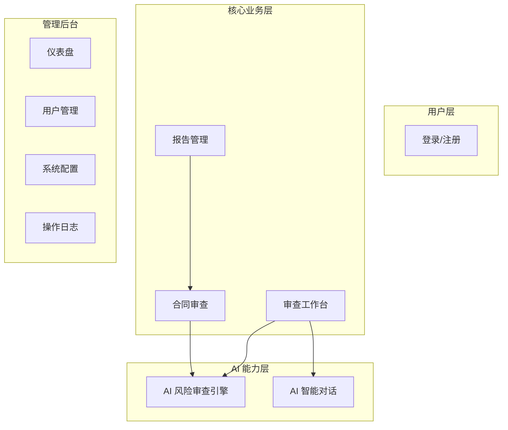
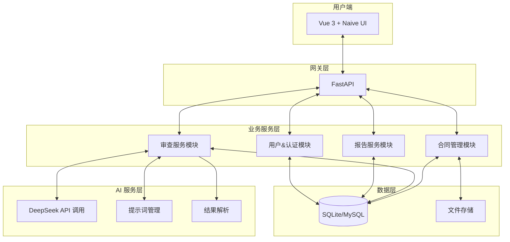
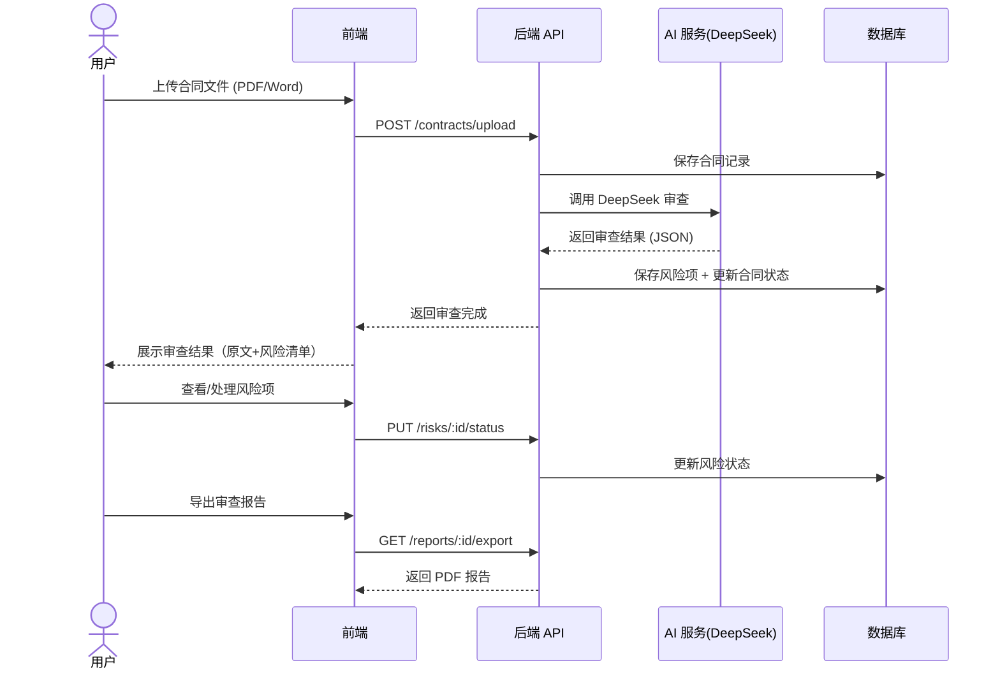
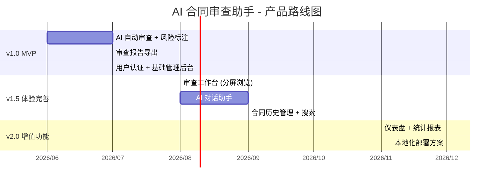

# 产品方案文档

> 文档状态：初稿 | 最后更新：2026-05-27

---

## 1. 产品定位

### 1.1 一句话定义

**AI 合同审查助手是一款面向政府机关和事业单位的轻量化智能合同审查工具，帮助非专业人士也能快速识别合同风险、规范审查流程。**

### 1.2 产品定位的三个关键词

| 关键词 | 含义 |
|--------|------|
| **轻量化** | 无需复杂部署，开箱即用，不改变现有 OA 和工作流 |
| **AI 原生** | 以 DeepSeek 大模型为核心驱动，而非传统规则引擎 |
| **政府适配** | 针对政府采购合同、服务合同等政府高频场景做了专项优化 |

### 1.3 产品边界

**我们做什么：**
- 合同全文 AI 风险审查与标注
- 审查报告的自动生成与归档
- 审查历史管理与审计留痕

**我们不做什么（明确不做的边界）：**
- 不替代 OA/合同管理系统的审批流（与现有系统互补）
- 不涉及电子签章/电子合同签署（纯审查工具）
- 不做合同全生命周期管理（专注审查环节）
- 不提供法律咨询服务（AI 输出仅供参考，人工复核为最终依据）

---

## 2. 核心价值主张

### 2.1 分角色的价值表述

| 角色 | 核心价值 |
|------|---------|
| 业务经办人 | **减少返工**：提交前自动预检，从源头降低退回率。参考陕西师大案例：传统退回率超 50%，AI 辅助后可降至 20% 以内[^4] |
| 法务审核人 | **提升效率**：AI 完成初筛和风险标注，法务只做复核和决策，效率提升 50%+。参考大足区实践：AI 审查使审核效率提升 50%[^1] |
| 分管领导 | **风险可控**：一个仪表盘看清所有合同的风险状况，审计时可一键导出全套审查记录 |
| 审计/纪检 | **全程留痕**：每一份合同的审查过程、修改记录、处理意见全量归档 |

### 2.2 价值量化测算（以区县级单位为例）

| 指标 | 传统模式 | 使用本产品 | 提升 |
|------|---------|-----------|------|
| 单份合同审查周期 | 2-5 天 | 0.5-1 天 | **节约 75%** |
| 合同退回修改率 | 30-50% | 10-20% | **降低 60%** |
| 法务人工审查时间 | 1-3 小时/份 | AI 初筛 5 分钟 + 人工复核 20 分钟 | **节约 70%** |
| 审计材料准备时间 | 2-3 天 | 10 分钟 | **节约 95%** |

---

## 3. 功能全景图

### 3.1 功能模块总览

### 3.2 功能模块详细说明

#### 模块一：合同审查（核心）

| 功能点 | 说明 | P0/P1/P2 |
|--------|------|----------|
| 合同上传 | 支持 PDF、Word 格式上传，自动提取全文 | P0 |
| AI 自动审查 | 调用 DeepSeek 大模型进行六维风险分析 | P0 |
| 风险条款标注 | 在合同原文中高亮标记有风险的条款 | P0 |
| 风险清单展示 | 按类别分组的风险列表，含风险等级、描述、法律依据、修改建议 | P0 |
| 风险项人工处理 | 支持标记"已处理"或"忽略"，保留人工裁量权 | P0 |
| 审查报告导出 PDF | 一键导出含审查结论、风险清单的正式报告 | P0 |

#### 模块二：审查工作台

| 功能点 | 说明 | P0/P1/P2 |
|--------|------|----------|
| 合同原文 + 风险清单分屏浏览 | 左侧原文、右侧风险列表，一一对照 | P0 |
| AI 聊天助手 | 针对当前合同内容向 AI 提问 | P1 |
| 合同搜索 | 全文检索历史合同 | P1 |
| 合规评分仪表盘 | 风险总览、评分趋势、按部门统计 | P2 |

#### 模块三：报告管理

| 功能点 | 说明 | P0/P1/P2 |
|--------|------|----------|
| 审查报告自动生成 | AI 审查完成后自动生成结构化报告 | P0 |
| 报告导出 PDF | 含审查结论、风险清单、合同原文 | P0 |
| 历史报告查询 | 按日期、合同名称、状态筛选 | P0 |

### 3.3 审查引擎六维模型

AI 审查从六个维度对合同进行逐条分析：

| 维度 | 审查重点 | 示例 |
|------|---------|------|
| 权利义务对等性 | 双方的权利义务是否平衡，是否存在单方过度倾斜 | 甲方无限扩大解释权 |
| 违约责任合理性 | 违约金是否过高，赔偿范围是否合理 | 100 万违约金 vs 9980 元合同总额 |
| 争议解决公平性 | 管辖法院约定是否对双方公平 | 仅约定甲方所在地法院 |
| 支付条款合规性 | 付款节奏、比例是否合理，有无潜在资金风险 | 签约即付 100% 全款 |
| 质量验收合理性 | 验收标准是否明确、可执行 | "以产品指南为准"导致标准模糊 |
| 法律时效合规性 | 有效期、通知期限等是否合法合规 | 无限期保密条款 |

---

## 4. 系统架构

### 4.1 技术架构图

### 4.2 关键设计决策

| 决策 | 选择 | 理由 |
|------|------|------|
| 前端框架 | Vue 3 + Naive UI | 政府项目普遍偏好 Vue 生态，Naive UI 组件丰富且符合国内设计习惯 |
| 后端框架 | Python FastAPI | 异步支持好，AI/LLM 集成方便，Python 生态成熟 |
| 数据库 | 开发环境 SQLite / 生产环境 MySQL | 开发简单，生产环境支持标准 SQL |
| 大模型 | DeepSeek API | 国产化要求，审查能力对标 GPT-4，成本可控 |
| 部署方式 | 支持本地化部署 | 政府客户对数据主权敏感，SaaS + 私有化双模式 |
| 认证方式 | JWT Token | 无状态认证，适合前后端分离架构 |

### 4.3 数据流

---

## 5. 产品路线图

### 5.1 版本规划

### 5.2 各版本核心目标

| 版本 | 目标 | 衡量指标 |
|------|------|---------|
| v1.0 MVP | 验证 AI 审查的核心价值，找到 PMF | 单份合同审查准确率 > 85%，用户留存率 > 60% |
| v1.5 | 提升用户体验和效率 | 审查全流程耗时 < 30 分钟，NPS > 40 |
| v2.0 | 拓展场景，增强壁垒 | 客户续费率 > 80%，本地化部署交付 |

---

## 6. 非功能需求

### 6.1 数据安全

- 支持私有化部署，数据不出单位内网
- 所有 AI 审查请求经过脱敏处理
- 权限分级管理（管理员/审核人）

### 6.2 可用性

- 核心审查流程零学习成本（上传→等待→出结果，三步完成）
- 关键操作有明确反馈和错误提示
- 支持 PC 浏览器访问（兼容主流国产浏览器）

### 6.3 性能

- 单份合同 AI 审查耗时 < 3 分钟（50 页以内）
- 页面首屏加载 < 2 秒
- 支持 50 人同时在线使用

---

## 7. 总结

AI 合同审查助手的产品定位是"轻量化、AI 原生、政府适配"的智能合同审查工具。核心逻辑是：**上传合同 → AI 自动审查 → 人工复核处理 → 报告归档**，用 AI 把合同审查效率提升一个数量级，同时保留人工的最终裁量权。

产品路线图分为三个阶段：v1.0 验证核心价值（AI 审查 + 风险展示 + 报告导出）、v1.5 打磨用户体验（工作台 + 对话 + 搜索）、v2.0 拓展场景壁垒（本地化部署）。

---

## 参考文献

[^1]: 重庆大足区. 创新政府合同风险预警管控机制. 2024. AI 审查使审核效率提升 50%.
[^2]: 山东威海市. 创新"四化联动"合同管理模式. 2025. 覆盖 356 家单位.
[^3]: 山东德州市. 德州多措并举筑牢政府合同风险屏障. 法治日报. 2025-04.
[^4]: 陕西师范大学. AI 辅助小额零星采购合同智能审核. 2025. 退回修改率从 50%+ 降至 20%.
[^5]: 河南济源市. "数字赋能+机制重塑"打造政采新模式. 2025.
