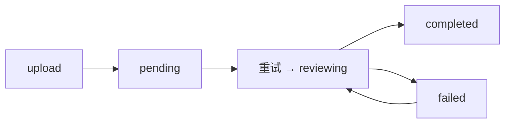

# PRD + 原型设计文档

> 文档状态：初稿 | 最后更新：2026-05-27
>
> 本文档合并了 PRD（产品需求）和原型设计，每个功能模块采用**文本线框图**展示界面布局，配合"交互规则 + 数据字段 + 验收标准"卡片式写法，前后端看同一份文档即可开发。
>
> 🎨 **原型对照**：本文档中的文本线框图对应 `prototype/` 目录下的 HTML 高保真原型，可打开对应页面直观查看。详见附录 [原型文件索引](#附录原型文件索引)。

---

## 目录

1. [登录](#1-登录)
2. [合同上传](#2-合同上传)
3. [审查等待页](#3-审查等待页)
4. [审查工作台（核心）](#4-审查工作台核心)
5. [审查报告](#5-审查报告)
6. [审查历史列表](#6-审查历史列表)
7. [AI 聊天助手](#7-ai-聊天助手)
8. [管理后台](#8-管理后台)

---

## 1. 登录

> 🎨 **原型对照**：[prototype/index.html](./prototype/index.html)

### 页面布局

```
┌──────────────────────────────────────────────┐
│                                              │
│                  ┌──────────┐                │
│                  │  AI 合同  │                │
│                  │ 审查助手  │                │
│                  └──────────┘                │
│                 · 用户登录 ·                  │
│                                              │
│    ┌──────────────────────────────────┐      │
│    │  用户名                            │      │
│    └──────────────────────────────────┘      │
│    ┌──────────────────────────────────┐      │
│    │  密码                            │      │
│    └──────────────────────────────────┘      │
│                                              │
│    ┌──────────────────────────────────┐      │
│    │          登  录                  │      │
│    └──────────────────────────────────┘      │
│                                              │
└──────────────────────────────────────────────┘
```

                                       🤖 ← 悬浮机器人图标，点击打开 AI 对话侧边栏

### 交互规则

| 操作 | 反馈 |
|------|------|
| 输入用户名/密码 | 支持回车键提交 |
| 点击登录 | 按钮置 Loading，调登录接口 |
| 登录失败 | 顶部显示错误提示（"用户名或密码错误"），不清空已输入内容 |
| 登录成功 | 跳转到合同列表页 |
| Token 过期 | 下次请求返回 401，自动跳回登录页，不清除 localStorage 但清除内存中 token |

### 数据字段

**POST /api/auth/login**

| 字段 | 类型 | 必填 | 说明 |
|------|------|------|------|
| username | string | 是 | 用户名 |
| password | string | 是 | 密码 |

**响应：**

| 字段 | 类型 | 说明 |
|------|------|------|
| access_token | string | JWT Token，有效期 480 分钟 |
| user | object | { id, username, role } |

### 验收标准

- [x] 输入正确凭证能登录并跳转到列表页
- [x] 输入错误凭证显示提示信息
- [x] 未登录访问任意页面自动跳转到登录页
- [x] Token 过期后自动跳回登录页
- [x] 空字段提交被拦截（"请输入用户名/密码"）
- [x] 已登录状态下访问 /login 自动跳转到首页

**优先级：** P0 | **涉及角色：** 全部用户

---

## 2. 合同上传

> 🎨 **原型对照**：[prototype/upload.html](./prototype/upload.html)

### 页面布局

```
┌──────────────────────────────────────────────┐
│  合同审查  │  监控台  │  报告管理            │
├──────────────────────────────────────────────┤
│                                              │
│         ┌──────────────────────┐             │
│         │                      │             │
│         │   📄 拖拽或点击上传   │             │
│         │  支持 PDF / Word     │             │
│         │  文件大小不超过 50MB │             │
│         │                      │             │
│         └──────────────────────┘             │
│                                              │
│         文件名：采购合同.pdf  ✓              │
│         合同名称：[________________]         │
│                                              │
│         ┌──────────────────────┐             │
│         │  开始审查            │             │
│         └──────────────────────┘             │
│                                              │
│          最近上传：                           │
│          ┌──────────────────────────┐        │
│          │ 采购合同.pdf  2026-05-27 │        │
│          │ 技术服务合同  2026-05-26 │        │
│          └──────────────────────────┘        │
│                                              │
└──────────────────────────────────────────────┘
```

                                       🤖 ← 悬浮机器人图标，点击打开 AI 对话侧边栏

### 交互规则

| 操作 | 反馈 |
|------|------|
| 点击上传区域 | 打开文件选择器，限制选择 .pdf/.doc/.docx |
| 拖拽文件到区域 | 区域边框高亮变蓝，显示"松开以上传" |
| 拖入非支持格式 | 区域显示红色边框 + "不支持的文件格式" |
| 文件超过 50MB | 弹窗提示"文件大小超过限制" |
| 选择文件后 | 显示文件名 + 绿色对勾，合同名称自动填入文件名（不含扩展名），允许手动修改 |
| 点击"开始审查" | 按钮置 Loading，跳转到审查等待页 |
| 文件已存在同名 | 不做去重处理，允许上传同名文件（靠 ID 区分） |

### 数据字段

**POST /api/contracts/upload** (multipart/form-data)

| 字段 | 类型 | 必填 | 说明 |
|------|------|------|------|
| file | File | 是 | PDF / Word 文件，最大 50MB |
| title | string | 否 | 合同名称，默认为文件名（不含扩展名） |

### 验收标准

- [x] 支持点击和拖拽上传两种方式
- [x] 非 PDF/Word 文件被拦截并提示
- [x] 上传成功后自动进入审查流程
- [x] 页面底部显示最近上传记录

**优先级：** P0 | **涉及角色：** 业务经办人

---

## 3. 审查等待页

### 页面布局

```
┌──────────────────────────────────────────────┐
│                                              │
│              ┌────────────┐                  │
│              │  ◌ ◌ ◌    │                  │
│              │  旋转动画  │                  │
│              └────────────┘                  │
│                                              │
│      正在审查「采购合同」...                  │
│                                              │
│      AI 正在分析合同条款，请稍候              │
│      预计需要 1-3 分钟                       │
│                                              │
│      ┌──────────────────────────┐            │
│      │  分析进度                  │            │
│      │  ████████░░░░ 60%        │            │
│      │  ✓ 文本提取完成           │            │
│      │  ✓ 条款切分完成           │            │
│      │  ◌ AI 风险分析中...       │            │
│      └──────────────────────────┘            │
│                                              │
└──────────────────────────────────────────────┘
```

                                       🤖 ← 悬浮机器人图标，点击打开 AI 对话侧边栏

### 交互规则

| 操作 | 反馈 |
|------|------|
| 页面加载 | 自动上传文件并开始审查，显示进度动画 |
| 审查完成 | 显示"查看审查报告"按钮，点击跳转到 [审查工作台](#4-审查工作台核心) |
| 审查失败 | 状态显示为"审查失败"，显示"重新审查"按钮 |
| 用户离开页面 | 不中断后台审查流程，可从最近上传列表重新进入 |

### 状态流转

```
upload → status="pending"
       → status="reviewing" (开始审查)
       → status="completed" (审查完成，跳转工作台)
       → status="failed"    (审查失败，显示重试按钮)
```

### 验收标准

- [x] 上传后自动进入等待页并显示进度动画
- [x] 审查完成有明确入口查看审查报告
- [x] 审查失败有明确的状态提示和重试能力

**优先级：** P0 | **涉及角色：** 业务经办人

---

## 4. 审查工作台（核心）

> 🎨 **原型对照**：[prototype/workbench.html](./prototype/workbench.html)

### 页面布局

```
┌──────────────────────────────────────────────────────────────────┐
│  ← 返回列表                                                      │
├─────────────────────────────────┬────────────────────────────────┤
│  左侧：合同原文 (60%)           │  右侧：审查结果 (40%)          │
│                                 │                                │
│  采购合同                       │  审查结果   [3高风险] [2警告]  │
│  ─────────────                  │  ─────────────────             │
│                                 │                                │
│  合同编号：LXKJ-...             │  ▼ 支付条款 (1)                │
│  甲方：人工智能...              │  ┌──────────────────────┐     │
│  乙方：深圳留形...              │  │ ① 第2条  高风险       │     │
│                                 │  │ 签约后3日内全额付款    │     │
│  ─────────────                  │  │ ⚠ 风险描述            │     │
│                                 │  │ 💡 修改建议            │     │
│  第一条 产品采购                │  │ ⚖ 法律依据            │     │
│                                 │  │ [忽略] [标记已处理]    │     │
│  1.1 甲方同意...                │  └──────────────────────┘     │
│                                 │                                │
│  第二条 采购价款支付             │  ▼ 违约责任 (2)                │
│  ① 2.1 采购价款...              │  ┌──────────────────────┐     │
│                                 │  │ ② 第7.4条  高风险    │     │
│  第三条 交付及验收               │  │ ...                  │     │
│                                 │  └──────────────────────┘     │
│  第四条 质保期...               │  ┌──────────────────────┐     │
│  ② 4.1 乙方就产品...            │  │ ③ 第7.5条  警告      │     │
│                                 │  │ ...                  │     │
│  第五条 保密及知识产权           │  └──────────────────────┘     │
│  ③ 5.2 未经乙方同意...          │                                │
│                                 │  ▼ 争议解决 (1)                │
│  第六条 贸易合规                │  ┌──────────────────────┐     │
│                                 │  │ ④ 第9.2条  高风险    │     │
│  第七条 违约责任                 │  │ ...                  │     │
│  ④ 7.4 如甲方违反...            │  └──────────────────────┘     │
│  ⑤ 7.5 如甲方违反...            │                                │
│                                 │                                │
│  第八条 不可抗力                │                                │
│                                 │                                │
│  第九条 争议解决                │                                │
│  ⑥ 9.2 任何一方...              │                                │
│                                 │                                │
└─────────────────────────────────┴────────────────────────────────┘
```

                                       🤖 ← 悬浮机器人图标，点击打开 AI 对话侧边栏

### 交互规则

#### 左侧合同原文

| 操作 | 反馈 |
|------|------|
| 有风险的条款 | 显示彩色序号圆圈（① ② ③...），红色=高风险、黄色=警告、蓝色=提示 |
| 点击带标记的条款 | 右侧面板自动滚动到对应风险项并高亮（黄色闪烁 2 秒） |
| 滚动 | 左右面板独立滚动，互不联动 |

#### 右侧风险清单

| 操作 | 反馈 |
|------|------|
| 风险分组 | 按类别（支付条款、违约责任、争议解决等）折叠/展开，默认全部展开 |
| 每个风险项 | 显示序号 + 条款位置 + 风险描述 + 修改建议 + 法律依据 |
| 点击"标记已处理" | 调用状态更新接口，该项变为灰色，底部显示"已处理"标签 |
| 点击"忽略" | 调用状态更新接口，该项变为浅灰色，底部显示"已忽略"标签 |
| 风险项数量 | 顶部实时更新高风险/警告的数量统计 |

#### AI 对话侧边栏

| 操作 | 反馈 |
|------|------|
| 点击底部 🤖 图标 | 从右侧滑出 AI 对话面板，覆盖右侧面板，宽度 380px |
| 面板打开时 | 显示历史对话记录（当前会话有效，刷新后清空） |
| 输入问题并发送 | 调聊天接口，AI 回复后追加到对话记录中 |
| 发送失败 | 对话中显示"发送失败"提示 |
| 点击面板外或关闭按钮 | 面板收起，回到右侧审查结果视图 |
| AI 回复中 | 发送按钮置 Loading，显示"AI 正在思考..." |

### 数据字段

**GET /api/contracts/{id}/risks**

| 字段 | 类型 | 说明 |
|------|------|------|
| id | int | 风险项 ID |
| contract_id | int | 所属合同 ID |
| clause_index | float | 条款编号（如 2、4.1、7.4） |
| clause_text | string | 原条款文本 |
| risk_level | string | high / medium / low |
| category | string | 分类：支付条款、违约责任、争议解决等 |
| description | string | 风险描述 |
| legal_basis | string | 法律依据 |
| suggestion | string | 修改建议 |
| status | string | active / fixed / ignored |

**PUT /api/contracts/{id}/risks/{riskId}/status**

| 字段 | 类型 | 必填 | 说明 |
|------|------|------|------|
| status | string | 是 | fixed / ignored |

### 验收标准

- [x] 左侧原文正确显示，风险条款带序号圆圈标记
- [x] 右侧风险按类别分组展示，每个风险项信息完整
- [x] 点击左侧风险条款，右侧滚动到对应项并高亮
- [x] 标记已处理/忽略后，状态正确更新并持久化
- [x] AI 对话侧边栏能正常打开、问答、关闭

**优先级：** P0 | **涉及角色：** 法务审核人（核心）、业务经办人、分管领导

---

## 5. 审查报告

### 页面布局

独立报告页：

```
┌──────────────────────────────────────────┐
│  报告编号：CR-000001                     │
│                          [导出报告]       │
├──────────────────────────────────────────┤
│                                          │
│  合同名称：采购合同                       │
│  合规评分：55/100                        │
│                                          │
│  ── 核心风险清单 ──                      │
│                                          │
│  🔴 高风险 · 支付条款 · 第2条           │
│     风险描述：...                        │
│     修改建议：...                        │
│     [待处理]                              │
│                                          │
│  🟡 警告 · 质量验收 · 第4.1条            │
│     风险描述：...                        │
│     [已处理 ✓]                           │
│                                          │
│  ── 审查结论 ──                          │
│  ...                                     │
│                                          │
└──────────────────────────────────────────┘
```

### 交互规则

| 操作 | 反馈 |
|------|------|
| 点击"导出报告" | 调导出接口，浏览器下载 PDF 文件 |
| 导出中 | 按钮显示 Loading 动画，防止重复点击 |
| 导出完成 | 浏览器保存到本地下载目录 |
| 导出失败 | 提示"导出失败，请重试" |
| 点击风险项状态按钮 | 调状态更新接口，在"待处理"/"已处理"/"已忽略"间切换 |

### PDF 报告内容结构

```
第 1 页：封面 — 报告编号、合同名称、审查日期、审查结论
第 2 页：审查结论 — 合规评分、总体评价、风险等级
第 3-N 页：风险清单 — 每条风险含：条款位置、风险等级、风险描述、法律依据、修改建议
最后页：免责声明 — "本报告由 AI 自动生成，仅供参考，不构成法律意见"
```

### 验收标准

- [x] 点击导出能正常下载 PDF 文件
- [x] PDF 内容与页面展示一致，排版清晰
- [x] 中文字体正常渲染（不出现乱码或方块）
- [x] 导出的报告包含完整的风险清单和审查结论
- [x] 风险清单中每个风险项显示状态并可切换

**优先级：** P0 | **涉及角色：** 法务审核人、分管领导、审计

---

## 6. 审查历史列表

> 🎨 **原型对照**：[prototype/history.html](./prototype/history.html)

### 页面布局

```
┌──────────────────────────────────────────────┐
│  审查历史记录               [🔍 搜索合同名称] │
├──────────────────────────────────────────────┤
│                                              │
│  ┌────────┬──────────┬────────┬────────┬───────────┐│
│  │ 合同名  │ 上传时间  │ 风险等级 │ 合规评分│   操作    ││
│  ├────────┼──────────┼────────┼────────┼───────────┤│
│  │ 采购合  │ 2026-05  │  高风险 │  55    │ 工作台    ││
│  │ 同.pdf  │ -27      │  (红色) │        │ 报告 删除 ││
│  ├────────┼──────────┼────────┼────────┼───────────┤│
│  │ 技术服  │ 2026-05  │  中风险 │  72    │ 工作台    ││
│  │ 务合同  │ -26      │  (黄色) │        │ 报告 删除 ││
│  └────────┴──────────┴────────┴────────┴───────────┘│
│                                              │
│  暂无审查记录 (空状态时)                      │
│                                              │
│                          < 1  2  3 ... 10 >  │
│                                              │
└──────────────────────────────────────────────┘

注：合同名称可点击跳转工作台，悬停时提示"查看原件"；删除前弹出确认弹窗。
```

### 交互规则

| 操作 | 反馈 |
|------|------|
| 搜索框输入 | 实时搜索（防抖 300ms），按合同名称模糊匹配 |
| 悬停合同名称 | 显示"查看原件"提示，点击在新标签页打开原件 |
| 点击合同名称 | 跳转到 [工作台](#4-审查工作台核心) |
| 删除合同 | 点击"删除"，弹出确认对话框含警告图标和说明文字，确认后删除并刷新列表 |
| 分页 | 每页 20 条，底部分页控件 |

### 数据字段

**GET /api/contracts?page=1&page_size=20&search=**

| 字段 | 类型 | 说明 |
|------|------|------|
| items | array | 合同列表 |
| items[].id | int | 合同 ID |
| items[].title | string | 合同名称 |
| items[].contract_type | string | 合同类型 |
| items[].file_type | string | pdf / docx |
| items[].status | string | pending / reviewing / completed / failed |
| items[].risk_level | string | high / medium / low / null |
| items[].compliance_score | int | 合规评分（0-100） |
| items[].created_at | datetime | 上传时间 |
| total | int | 总数 |

### 验收标准

- [x] 合同列表正确分页展示
- [x] 搜索能按名称模糊匹配
- [x] 点击合同跳转到工作台
- [x] 悬停合同名称提示"查看原件"，点击打开原始文件
- [x] 删除有确认弹窗，确认后正确删除

**优先级：** P0 | **涉及角色：** 全部用户

---

## 7. AI 聊天助手

### 页面布局

点击工作台右下角 🤖 图标后，从右侧滑出的浮动侧边栏（覆盖在右侧风险面板之上）：

```
┌──────────────────────────────────┐
│  AI 对话                   ✕    │  ← 顶部栏含关闭按钮
├──────────────────────────────────┤
│                                  │
│  ┌─ 用户 ──────────────────────┐ │
│  │ 这条违约金合法吗？           │ │
│  └─────────────────────────────┘ │
│                                  │
│  ┌─ AI 助手 ───────────────────┐ │
│  │ 该条款约定的 100 万元违约金   │ │
│  │ 占合同总额 9980 元的约 100   │ │
│  │ 倍，根据《民法典》第 585 条，  │ │
│  │ 可能被认定为过高。建议...     │ │
│  └─────────────────────────────┘ │
│                                  │
│  (历史对话记录，仅当前会话有效)  │
│                                  │
│                                  │
│                                  │
├──────────────────────────────────┤
│  [输入问题...           ] [发送]│
└──────────────────────────────────┘
```

### 交互规则

| 操作 | 反馈 |
|------|------|
| 点击 🤖 图标 | 侧边栏从右侧滑入，宽度 380px，覆盖在风险面板上方 |
| 点击 ✕ 或侧边栏外部 | 侧边栏滑出收起，回到风险面板视图 |
| 输入问题并发送 | 清空输入框，等待 AI 回复 |
| AI 回复中 | 发送按钮置 Loading，显示"AI 正在思考..." |
| 回复完成 | 追加对话记录到侧边栏中 |
| 对话历史 | 不持久化，刷新页面后清空（仅当前会话有效） |
| 问题关联合同 | AI 默认以上下文中的合同为分析对象，无需重复上传 |

### 数据字段

**POST /api/contracts/{id}/chat**

| 字段 | 类型 | 必填 | 说明 |
|------|------|------|------|
| message | string | 是 | 用户提问 |

**响应**

| 字段 | 类型 | 说明 |
|------|------|------|
| content | string | AI 回复内容 |

### 验收标准

- [ ] 能正常发送问题并收到 AI 回复
- [ ] 发送按钮在回复过程中正确显示 Loading 状态
- [ ] 回复内容与当前合同上下文相关

**优先级：** P1 | **涉及角色：** 法务审核人

---

## 8. 管理后台

管理后台包含四个标签页：仪表盘、用户管理、操作日志、系统配置。仅在当前用户为 admin 角色时显示导航入口。

### 8.1 仪表盘 (Dashboard)

#### 页面布局

```
┌──────────────────────────────────────────────────────────┐
│  仪表盘  │  用户管理  │  操作日志  │  系统配置            │
├──────────────────────────────────────────────────────────┤
│                                                          │
│  ┌───────┐  ┌───────┐  ┌───────┐  ┌───────┐            │
│  │审查总数│  │高风险  │  │平均分 │  │用户数 │            │
│  │  45   │  │   8   │  │ 68.5  │  │   6   │            │
│  └───────┘  └───────┘  └───────┘  └───────┘            │
│                                                          │
│  ┌─────────────┐  ┌─────────────┐                        │
│  │ 合同状态分布  │  │  今日上传    │                        │
│  │  30完成      │  │    12       │                        │
│  │  3审查中     │  │   份合同     │                        │
│  │  2失败       │  └─────────────┘                        │
│  └─────────────┘                                        │
│                                                          │
└──────────────────────────────────────────────────────────┘
```

#### 交互规则

| 操作 | 反馈 |
|------|------|
| 页面加载 | 自动请求 4 个统计卡片数据 + 状态分布 + 今日上传数 |
| 数据加载中 | 卡片区域显示 spin 加载动画 |

#### 数据字段

**GET /api/admin/stats**

| 字段 | 类型 | 说明 |
|------|------|------|
| total_contracts | int | 合同总数 |
| high_risk | int | 高风险合同数 |
| avg_score | float | 平均合规分 |
| total_users | int | 用户总数 |
| recent_contracts | int | 今日上传数 |
| contracts_by_status | object | { completed, failed, reviewing, pending } |

### 8.2 用户管理

#### 页面布局

```
┌──────────────────────────────────────────────────────────┐
│  仪表盘  │  用户管理  │  操作日志  │  系统配置            │
├──────────────────────────────────────────────────────────┤
│  共 6 人                          [新建用户]              │
│                                                          │
│  ┌──────┬──────┬──────────┬──────┬──────┬────────┐      │
│  │用户名│ 姓名 │  角色     │ 部门  │ 状态  │  操作   │      │
│  ├──────┼──────┼──────────┼──────┼──────┼────────┤      │
│  │admin │管理员│ ● 管理员 │技术部│ ON   │ 编辑  │      │
│  │张三  │张三  │ ○ 审核人 │财务部│  ON  │ 编辑 删除│      │
│  │李四  │李四  │ ○ 审核人 │法务部│ OFF  │ 编辑 删除│      │
│  └──────┴──────┴──────────┴──────┴──────┴────────┘      │
│                                                          │
└──────────────────────────────────────────────────────────┘

新建/编辑弹窗：
┌──────────────────────┐
│  新建用户             │
├──────────────────────┤
│  用户名  [________]  │
│  姓名    [________]  │
│  密码    [________]  │
│  角色    [审核人 ▼]  │
│  部门    [________]  │
├──────────────────────┤
│     [取消]  [保存]   │
└──────────────────────┘
```

#### 交互规则

| 操作 | 反馈 |
|------|------|
| 新建用户 | 打开弹窗表单，用户名、密码为必填 |
| 编辑用户 | 打开弹窗，用户名禁用修改，密码为空则不修改 |
| 删除用户 | 弹窗确认"确定删除用户？删除后不可恢复"，不可删除自己（隐藏删除按钮） |
| 状态切换 | 滑块开关，点击即时调用接口切换启用/禁用，不可禁用自己 |
| 角色展示 | 管理员=蓝色标签带圆点，审核人=灰色标签 |
| 操作反馈 | 成功/失败均显示顶部消息提示 |

#### 数据字段

**GET /api/admin/users**

| 字段 | 类型 | 说明 |
|------|------|------|
| id | int | 用户 ID |
| username | string | 用户名 |
| display_name | string | 显示名称 |
| role | string | admin / reviewer |
| department | string | 部门 |
| is_active | bool | 是否启用 |
| created_at | datetime | 创建时间 |

**POST /api/admin/users**

| 字段 | 类型 | 必填 | 说明 |
|------|------|------|------|
| username | string | 是 | 登录用户名 |
| password | string | 是 | 密码 |
| display_name | string | 否 | 显示名称 |
| role | string | 否 | admin / reviewer |
| department | string | 否 | 部门 |

**PUT /api/admin/users/{id}**

| 字段 | 类型 | 必填 | 说明 |
|------|------|------|------|
| display_name | string | 否 | 显示名称 |
| role | string | 否 | 角色 |
| department | string | 否 | 部门 |
| password | string | 否 | 新密码，留空不修改 |

**DELETE /api/admin/users/{id}** — 删除用户

**PUT /api/admin/users/{id}/status** — 切换启用/禁用，返回 `{ is_active: bool }`

### 8.3 操作日志

#### 页面布局

```
┌──────────────────────────────────────────────────────────┐
│  仪表盘  │  用户管理  │  操作日志  │  系统配置            │
├──────────────────────────────────────────────────────────┤
│  操作类型筛选: [全部 ▼]                                   │
│                                                          │
│  ┌──────────────────┬──────┬────────┬──────┬───────────┐ │
│  │      时间         │ 用户  │  操作  │ 对象  │   详情    │ │
│  ├──────────────────┼──────┼────────┼──────┼───────────┤ │
│  │2026-05-27 14:30  │admin │ 创建   │user#3│创建用户张三│ │
│  │2026-05-27 14:25  │admin │ 删除   │ct#2  │删除合同XX  │ │
│  │2026-05-27 14:20  │admin │ 配置更新│config│更新API Key│ │
│  └──────────────────┴──────┴────────┴──────┴───────────┘ │
│                                                          │
│                                     < 1  2  3 >          │
└──────────────────────────────────────────────────────────┘
```

#### 交互规则

| 操作 | 反馈 |
|------|------|
| 操作类型筛选 | 下拉选择：全部、创建、编辑、删除、启用/禁用、风险更新、配置更新 |
| 分页 | 每页 50 条，超过时显示分页控件 |
| 操作标签 | 按类型显示不同颜色：创建=绿、编辑=蓝、删除=红、配置=灰 |

#### 数据字段

**GET /api/admin/logs?page=1&page_size=50&action=**

| 字段 | 类型 | 说明 |
|------|------|------|
| items[].id | int | 日志 ID |
| items[].user_id | int | 操作人 ID |
| items[].username | string | 操作人用户名 |
| items[].action | string | 操作类型：create/update/delete/toggle_status/update_risk/update_config |
| items[].target_type | string | 操作对象类型：contract/user/risk/config |
| items[].target_id | int | 对象 ID（可为空） |
| items[].detail | string | 详细描述 |
| items[].created_at | datetime | 操作时间 |
| total | int | 总数 |

### 8.4 系统配置

#### 页面布局

```
┌──────────────────────────────────────────────────────────┐
│  仪表盘  │  用户管理  │  操作日志  │  系统配置            │
├──────────────────────────────────────────────────────────┤
│                                                          │
│  API Key    [●●●●●●●●●●●●●●●●●●]  👁                   │
│  模型       [deepseek-chat          ]                   │
│  Base URL   [https://api.deepseek.com]                   │
│                                                          │
│  [保存配置]                                              │
│                                                          │
└──────────────────────────────────────────────────────────┘
```

#### 交互规则

| 操作 | 反馈 |
|------|------|
| API Key | 密码输入框，可点击眼睛图标显示明文 |
| 模型名称 | 文本框，如 deepseek-chat / deepseek-reasoner |
| Base URL | 文本框，API 地址 |
| 保存配置 | 按钮置 Loading，调用更新接口，提示"配置已保存" |
| 重新加载 | 切换到此标签页时自动加载最新配置 |

#### 数据字段

**GET /api/admin/config**

| 字段 | 类型 | 说明 |
|------|------|------|
| llm_model | string | LLM 模型名称 |
| llm_base_url | string | API 地址 |
| llm_api_key_masked | string | API Key 掩码显示（前8位+****） |

**PUT /api/admin/config**

| 字段 | 类型 | 必填 | 说明 |
|------|------|------|------|
| llm_api_key | string | 否 | API Key |
| llm_model | string | 否 | 模型名称 |
| llm_base_url | string | 否 | API 地址 |

### 验收标准

- [ ] 仅管理员可访问管理后台
- [ ] 仪表盘正确显示统计数据
- [ ] 用户 CRUD 完整可用（新建/编辑/删除/启用禁用）
- [ ] 不可删除或禁用自己
- [ ] 操作日志记录所有关键操作并正确分页
- [ ] 系统配置可保存和读取（API Key 回显时掩码）

**优先级：** P1 | **涉及角色：** 管理员

---

## 附录：API 接口汇总

| 模块 | 方法 | 路径 | 说明 | 优先级 |
|------|------|------|------|--------|
| 认证 | POST | /api/auth/login | 登录 | P0 |
| 认证 | GET | /api/auth/me | 获取当前用户 | P0 |
| 合同 | POST | /api/contracts/upload | 上传合同 | P0 |
| 合同 | GET | /api/contracts | 合同列表 | P0 |
| 合同 | GET | /api/contracts/{id} | 合同详情 | P0 |
| 合同 | DELETE | /api/contracts/{id} | 删除合同 | P0 |
| 风险 | GET | /api/contracts/{id}/risks | 风险列表 | P0 |
| 风险 | PUT | /api/contracts/{id}/risks/{rid}/status | 更新风险状态 | P0 |
| 统计 | GET | /api/admin/stats | 审查统计数据 | P0 |
| 报告 | GET | /api/contracts/{id}/report | 审查报告 | P0 |
| 报告 | GET | /api/contracts/{id}/report/export | 导出 PDF | P0 |
| 聊天 | POST | /api/contracts/{id}/chat | AI 问答 | P1 |
| 管理 | GET | /api/admin/users | 用户列表 | P1 |
| 管理 | POST | /api/admin/users | 新建用户 | P1 |
| 管理 | PUT | /api/admin/users/{id} | 编辑用户 | P1 |
| 管理 | DELETE | /api/admin/users/{id} | 删除用户 | P1 |
| 管理 | PUT | /api/admin/users/{id}/status | 启用/禁用用户 | P1 |
| 管理 | GET | /api/admin/logs | 操作日志（分页） | P1 |
| 管理 | GET/PUT | /api/admin/config | 系统配置 | P1 |

---

## 附录：页面路由汇总

| 路由 | 页面 | 认证 | 角色限制 |
|------|------|------|---------|
| /login | 登录 | 否 | — |
| /contracts | 合同列表 | 是 | — |
| /contracts/upload | 上传合同 | 是 | — |
| /contracts/{id}/review | 审查等待页 | 是 | — |
| /contracts/{id}/workbench | 审查工作台 | 是 | — |
| /contracts/{id}/detail | 合同详情(只读) | 是 | — |
| /contracts/{id}/report | 审查报告 | 是 | — |
| /admin | 管理后台 | 是 | admin 角色 |

---

## 附录：状态机与异常处理

### 合同状态机



### 前端异常处理矩阵

| 场景 | 展示 |
|------|------|
| 网络断开 | 顶部横幅"网络连接已断开，请检查网络" |
| API 返回 401 | 跳回登录页 |
| API 返回 500 | 弹窗提示"服务器异常，请稍后重试" |
| 文件上传失败 | 上传区域显示红色提示"上传失败，请重试" |
| AI 审查超时 | 等待页超过 5 分钟显示"审查超时，请联系管理员" |
| AI 聊天失败 | 聊天区域显示红色提示"AI 暂时无法回复，请稍后再试" |

### 空状态

| 页面 | 空状态展示 |
|------|-----------|
| 合同列表 | "暂无合同，点击上传您的第一份合同" + 上传按钮 |
| 审查工作台 | "暂无审查结果" |
| 用户管理 | "暂无用户" |

### 加载状态

| 场景 | 展示 |
|------|------|
| 页面首次加载 | 居中 spin + "正在加载..." |
| 列表刷新 | 列表上方小 spin + "刷新中..." |
| 提交表单 | 按钮置 Loading + 禁用点击 |
| 切换 Tab | 内容区域显示骨架屏（skeleton） |

---

## 附录：原型文件索引

本文档中的文本线框图对应 `prototype/` 目录下的 HTML 高保真原型，可直接打开浏览器对照查看。

| PRD 章节 | 原型文件 | 说明 |
|---------|---------|------|
| [1. 登录](#1-登录) | [prototype/index.html](./prototype/index.html) | 登录页面，左右分栏布局 |
| [2. 合同上传](#2-合同上传) | [prototype/upload.html](./prototype/upload.html) | 上传页，含步骤条 |
| [4. 审查工作台](#4-审查工作台核心) | [prototype/workbench.html](./prototype/workbench.html) | 核心工作台，原文+风险卡片 |
| [5. 审查报告导出](#5-审查报告导出) | [prototype/report.html](./prototype/report.html) | 审查报告，含图表可视化 |
| [6. 合同历史列表](#6-合同历史列表) | [prototype/history.html](./prototype/history.html) | 历史记录，统计看板+表格 |
