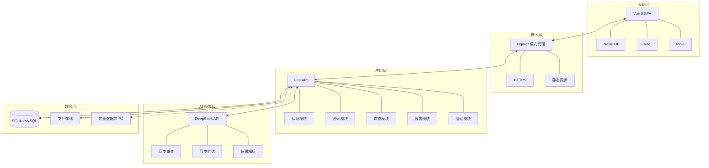
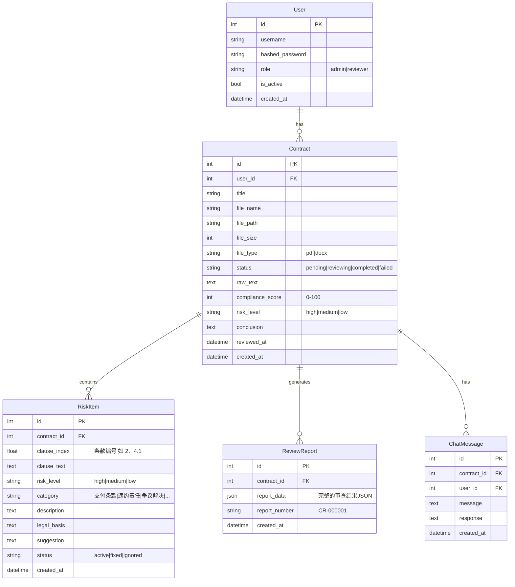
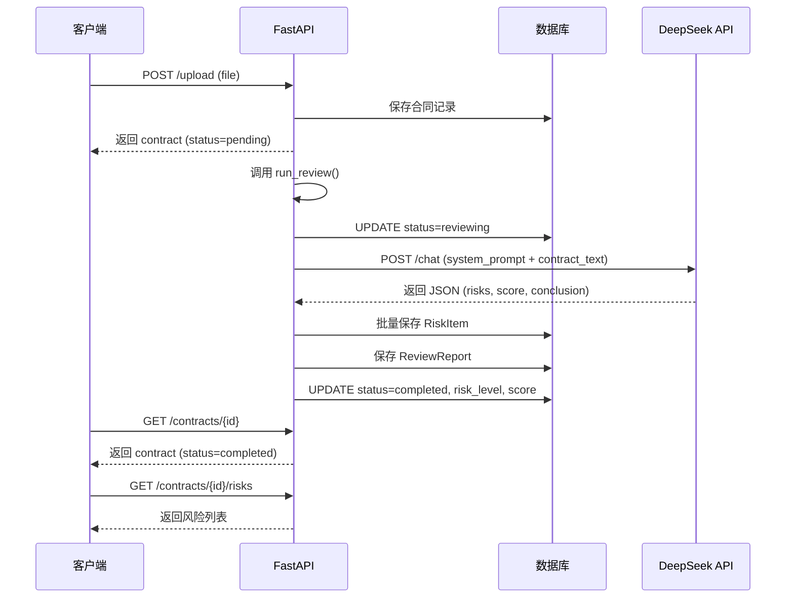
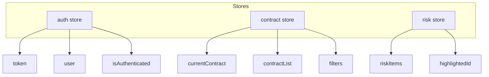
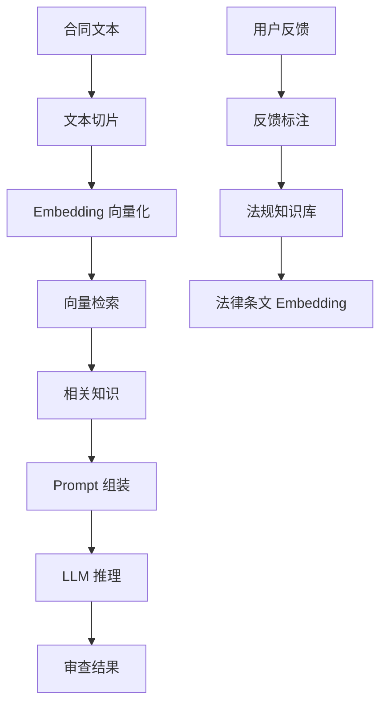
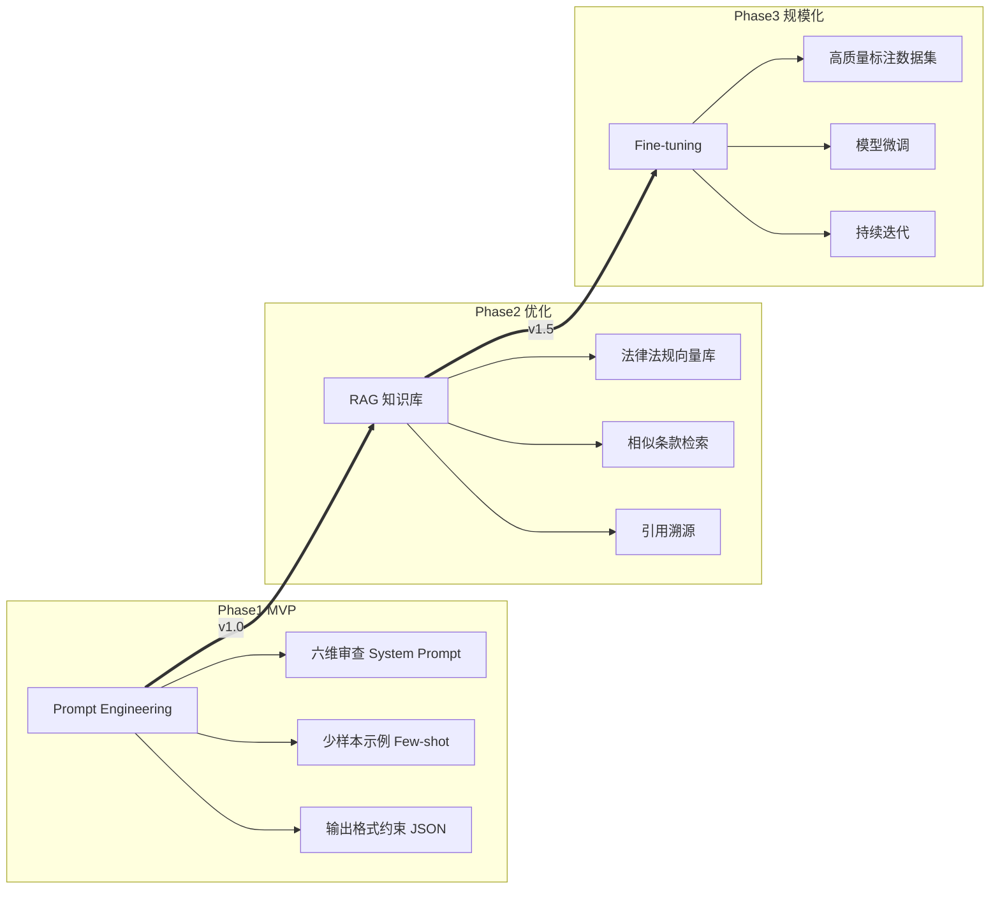
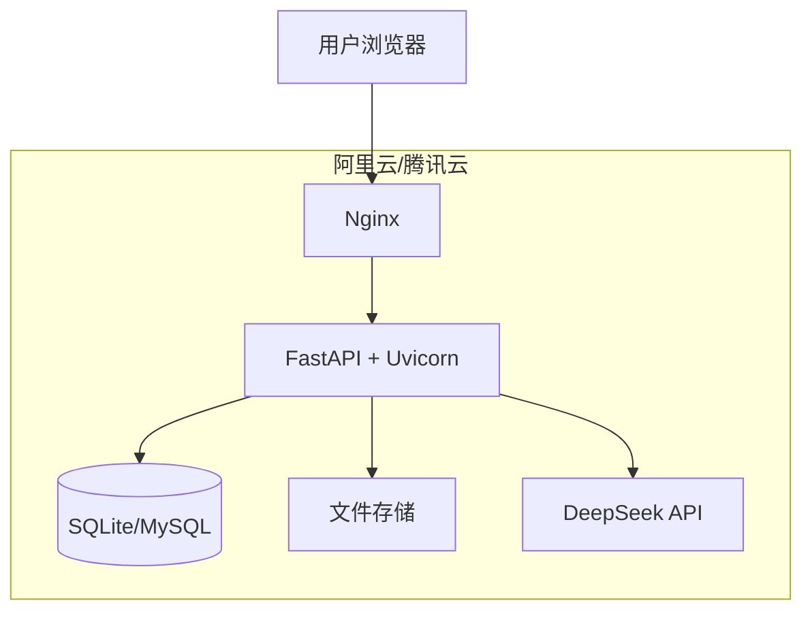
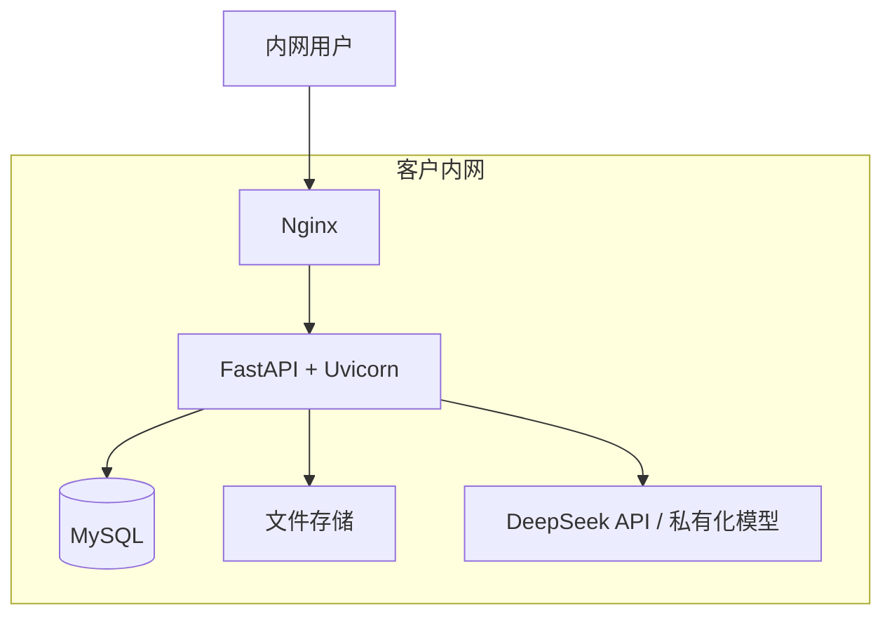

# 技术方案文档

> 文档状态：初稿 | 最后更新：2026-05-28

---

## 目录

1. [技术架构总览](#1-技术架构总览)
2. [后端架构设计](#2-后端架构设计)
3. [前端架构设计](#3-前端架构设计)
4. [模型选型方案](#4-模型选型方案)
5. [知识注入方案](#5-知识注入方案)
6. [AI 审查引擎设计](#6-ai-审查引擎设计)
7. [部署方案](#7-部署方案)
8. [安全设计](#8-安全设计)

---

## 1. 技术架构总览

### 1.1 架构分层



### 1.2 技术栈选型

| 层级 | 技术 | 选型理由 |
|------|------|---------|
| 前端框架 | Vue 3 + TypeScript | 政府项目生态成熟，社区活跃，组件库丰富 |
| UI 组件库 | Naive UI | 国产组件库，API 设计优雅，Tree-shaking 友好 |
| 构建工具 | Vite | 开发热更新快，打包体积小 |
| 状态管理 | Pinia | Vue 3 官方推荐，TypeScript 支持好 |
| 后端框架 | Python FastAPI | 异步原生，自动生成 OpenAPI 文档，AI 生态无缝对接 |
| ORM | SQLAlchemy 2.0 (async) | 最成熟的 Python ORM，异步支持完善 |
| 数据库 | SQLite（开发）/ MySQL（生产） | 开发零配置，生产满足性能需求 |
| AI 模型 | DeepSeek API | 国产化要求，法律文本理解能力优秀 |
| 认证 | JWT (python-jose) | 无状态，适合前后端分离 |

### 1.3 核心技术决策

| 决策 | 选择 | 权衡 |
|------|------|------|
| 同步 vs 流式输出 | 同步（当前）/ 流式（P2） | 同步实现简单；流式体验更好但架构复杂 |
| 长连接 vs 轮询 | 轮询（当前）/ WebSocket（P2） | 审查等待页每 3s 轮询状态，够用且简单 |
| 单体 vs 微服务 | 单体应用 | 当前规模下微服务过度设计，后期可按模块拆分 |
| 关系型 vs 文档型 | 关系型（SQLite/MySQL） | 数据结构固定，关系型更合适 |

---

## 2. 后端架构设计

### 2.1 模块划分

```
app/
├── main.py                  # 应用入口
├── core/
│   ├── config.py            # 配置管理
│   ├── database.py          # 数据库引擎 & 会话
│   ├── deps.py              # 依赖注入（认证等）
│   ├── security.py          # JWT + 密码哈希
│   └── llm/                 # LLM 抽象层
│       ├── base.py          # 抽象接口
│       ├── deepseek.py      # DeepSeek 实现
│       └── factory.py       # 工厂模式（支持切换模型）
├── modules/
│   ├── auth/                # 用户认证模块
│   ├── contracts/           # 合同管理模块
│   ├── risks/               # 风险审查模块
│   ├── reports/             # 报告模块
│   ├── chat/                # AI 对话模块
│   └── admin/               # 管理后台
└── llm/                     # Prompt 管理
    └── prompts.py           # 审查、对话、起草 Prompt
```

### 2.2 数据库设计

#### ER 图



#### 关键表字段说明

**RiskItem 的 category 枚举值：**

| 值 | 说明 | 审查维度 |
|----|------|---------|
| 支付条款 | 付款节奏、比例、条件 | 支付条款合规性 |
| 违约责任 | 违约金、赔偿范围 | 违约责任合理性 |
| 争议解决 | 管辖法院、仲裁 | 争议解决公平性 |
| 质量验收 | 验收标准、异议期 | 质量验收合理性 |
| 权利义务 | 双方权责对等性 | 权利义务对等性 |
| 法律时效 | 有效期、通知期限 | 法律时效合规性 |
| 其他 | 未归类的风险项 | — |

### 2.3 API 设计规范

- **基础路径**：`/api/{version}/`
- **版本策略**：URL Path 版本（如 `/api/v1/`），当前未启用版本
- **响应格式**：统一 JSON，错误时返回 `{ "detail": "..." }`
- **认证方式**：Bearer JWT Token
- **分页规范**：`?page=1&page_size=20`，响应含 `total` 字段

### 2.4 异步任务流程（AI 审查）



---

## 3. 前端架构设计

### 3.1 路由与组件

| 路由 | 页面组件 | 功能 |
|------|---------|------|
| `/login` | LoginPage | 登录 |
| `/` | UploadPage | 上传合同（首页） |
| `/contracts` | HistoryPage | 合同历史列表 |
| `/review` | ReviewPage | 审查等待 |
| `/contracts/:id` | WorkbenchPage | 审查工作台 |
| `/contracts/:id/report` | ReportPage | 审查报告 |
| `/admin` | AdminPage | 管理后台 |

### 3.2 状态管理（Pinia）



---

## 4. 模型选型方案

### 4.1 评估框架

模型选型采用**加权评分矩阵法**，从六个维度对候选模型进行量化评估。权重基于 AI 合同审查场景的核心需求确定：

| 评估维度 | 权重 | 说明 |
|---------|------|------|
| 法律文本理解能力 | 30% | 对合同条款的语义理解、风险识别准确性 |
| 中文语境适配度 | 20% | 对中文法律术语、政府文件表述的理解能力 |
| 合规与数据安全 | 20% | 数据是否出境、是否可私有化部署、国产化资质 |
| 响应速度 | 10% | 审查一份合同（约 3000 tokens）的端到端耗时 |
| 成本 | 10% | 每份合同的 API 调用成本及长期使用成本 |
| 生态与可扩展性 | 10% | API 稳定性、文档质量、模型更新频率 |

### 4.2 候选模型对比矩阵

| 评估维度 | 权重 | DeepSeek (V4) | GPT-4o | 通义千问 (Qwen-Max) | 文心一言 4.0 | GLM-4-Plus |
|---------|------|:---:|:---:|:---:|:---:|:---:|
| 法律文本理解 | 30% | 9.5 | 9.5 | 8.5 | 8.0 | 8.5 |
| 中文语境适配 | 20% | 9.5 | 8.5 | 9.5 | 9.5 | 9.5 |
| 合规与安全 | 20% | 10.0 | 4.0 | 9.0 | 10.0 | 10.0 |
| 响应速度 | 10% | 9.5 | 8.5 | 8.0 | 6.5 | 8.0 |
| 成本 | 10% | 10.0 | 5.0 | 8.0 | 6.0 | 8.0 |
| 生态与扩展 | 10% | 8.5 | 9.5 | 8.5 | 6.5 | 8.0 |
| **加权总分** | **100%** | **9.55** | **7.35** | **8.60** | **8.10** | **8.80** |

> 评分说明：以上评分为基于公开基准测试与实测体验的综合评估，用于选型参考。法律文本理解为基于 LegalBench 及其他法律测试集的综合表现。

### 4.3 选型结论

**首选方案：DeepSeek V4**

核心理由：

1. **法律理解能力一流且成本极低**：DeepSeek V4 在中文法律文本理解上已追平甚至超越 GPT-4o，API 价格却仅为 GPT-4 系列的约 1/30。以合同审查为例，一份合同约 3000 tokens：
   - DeepSeek V4：输入 ¥0.5 / 1M tokens，输出 ¥2.0 / 1M tokens → **单份成本约 ¥0.008**
   - GPT-4o：输入 $2.50 / 1M tokens，输出 $10.00 / 1M tokens → **单份成本约 $0.03 ~ ¥0.22**

2. **国产化合规**：模型由深度求索公司开发，数据不出境，满足信创要求。

3. **长上下文支持**：DeepSeek V4 支持 1M tokens 上下文窗口，足以覆盖完整合同及其附件。

4. **高并发与性价比**：相比 V3，V4 在推理速度和并发能力上有显著提升，同时保持了极具竞争力的价格。

**备选方案：GLM-4-Plus**
- 当 DeepSeek 不可用时作为备选，法律文本理解与中文适配能力接近 DeepSeek V4
- 通过 LLM 工厂模式（见 2.1 节）可一键切换

### 4.4 成本测算

以每月 200 份合同估算：

| 项目 | 计算方式 | 月成本 |
|------|---------|--------|
| AI 审查 | 200 份 × 0.008 = ¥1.6 | ¥1.6 |
| AI 对话 | 500 次 × 0.004 = ¥2.0 | ¥2.0 |
| 服务器 | 轻量云服务器 | ¥200-500 |
| **合计** | | **¥203.6-503.6** |

### 4.5 国产化适配评估

| 要求 | 满足情况 | 说明 |
|------|---------|------|
| 模型国产化 | ✅ | DeepSeek 国产自研 |
| 硬件自主可控 | ⚠️ 部分满足 | SaaS 模式无要求；私有化部署需国产 GPU（昇腾） |
| 数据不出境 | ✅ | DeepSeek API 国内调用，数据留在国内 |
| 信创目录 | ⚠️ 待确认 | 需查看 DeepSeek 是否在当期信创目录，不在则需要用 GLM-4-Plus 替代 |

---

## 5. 知识注入方案

### 5.1 知识注入方法对比

AI 领域将法律知识注入模型的主流方法有三种，分别适用于不同阶段和场景：

| 方法 | 原理 | 适用场景 | 成本 | 效果 | 维护成本 |
|------|------|---------|------|------|---------|
| **Prompt Engineering** | 通过精心设计的提示词引导模型输出 | 快速验证、通用场景 | 低 | 中 | 低 |
| **RAG（检索增强生成）** | 检索外部知识库，结果注入上下文 | 知识密集型、时效性要求高 | 中 | 高 | 中 |
| **Fine-tuning** | 在领域数据上对模型进行微调 | 长期使用、特定格式要求 | 高 | 非常高 | 高 |

#### 方法一：Prompt Engineering

**原理**：通过系统提示词（System Prompt）定义模型的角色、任务、输出格式，引导模型在推理过程中利用其预训练阶段习得的知识。

**优点**：
- 零成本，无需额外基础设施
- 迭代快，改一段文本即可
- 通用性强，覆盖所有审查维度

**缺点**：
- 模型知识截止于训练数据日期，无法覆盖最新法规
- 对模型推理能力依赖高，复杂场景可能漏判
- 无法引用具体法条条款号（模型可能"幻觉"法条）

**适用阶段**：MVP 快速验证

#### 方法二：RAG（检索增强生成）

**原理**：将相关法律法规、判例、标准合同条款向量化存储，审查时将合同文本作为 query 检索相关法条，注入到 Prompt 上下文中供模型参考。

**架构**：



**优点**：
- 可引用具体法条（"根据《民法典》第 585 条"），可信度高
- 知识库可随时更新，覆盖最新法规
- 减少模型幻觉，输出有据可查

**缺点**：
- 需要搭建向量数据库和检索服务
- 切片策略和检索质量直接影响效果
- 增加推理延迟（检索 + 更多上下文 tokens）

**适用阶段**：v1.5+ 效果优化

#### 方法三：Fine-tuning

**原理**：在高质量标注数据上对模型进行微调，使模型掌握特定法律审查任务的输出风格和知识。

**优点**：
- 审查质量最高，可深度定制
- 输出结构稳定（如统一的 JSON 格式）
- 推理速度快（无需外部检索）

**缺点**：
- 需要大量高质量标注数据（千份级以上）
- 训练成本高
- 模型版本更新后需重新微调
- 数据飞轮依赖用户反馈闭环

**适用阶段**：v2.0+ 规模化

### 5.2 三阶段演进路线

结合产品路线图，建议采用**渐进式知识注入策略**：



| 阶段 | 方法 | 预期效果 | 投入 |
|------|------|---------|------|
| v1.0 MVP | Prompt Engineering | 基础审查准确率 > 80% | 低（1-2 周） |
| v1.5 优化 | RAG + Prompt | 准确率 > 90%，可溯源 | 中（4-6 周） |
| v2.0 规模化 | Fine-tuning | 准确率 > 95%，响应更快 | 高（持续投入） |

### 5.3 当前方案详细设计：Prompt Engineering

#### 系统提示词设计原则

1. **角色定义**：明确模型扮演"资深合同审查律师"角色
2. **任务分解**：六维度逐一分析，而非一次性输出
3. **输出约束**：强制 JSON 格式，字段名和类型固定
4. **少样本示例**：每个维度给出正面示例，引导模型
5. **安全兜底**：要求模型不确定时标注"需人工复核"

#### 审查提示词结构

```
System Prompt:
你是一位有 15 年经验的资深合同审查律师，...
请从以下 6 个维度分析合同条款：...

User Prompt:
合同原文：
{contract_text}

请以 JSON 格式输出审查结果：
{
  "risks": [
    {
      "clause_index": "条款编号",
      "clause_text": "原文",
      "risk_level": "high/medium/low",
      "category": "支付条款/违约责任/...",
      "description": "风险描述",
      "legal_basis": "法律依据",
      "suggestion": "修改建议"
    }
  ],
  "compliance_score": 0-100,
  "conclusion": "审查结论",
  "risk_level": "high/medium/low"
}

注意事项：
1. 每个风险项必须包含法律依据...
2. 不确定的条款标注 risk_level=low...
...
```

完整提示词见第 6 章。

### 5.4 RAG 知识库设计（P1 路线）

#### 知识库构成

| 知识类型 | 内容来源 | 更新频率 | 优先级 |
|---------|---------|---------|--------|
| 国家法律法规 | 《民法典》《政府采购法》《招标投标法》等 | 年度 | P0 |
| 行政法规 | 国务院令、各部委规章 | 年度 | P0 |
| 司法解释 | 最高法/最高检司法解释 | 年度 | P1 |
| 合同范本 | 政府发布的各类合同示范文本 | 持续 | P1 |
| 审查案例库 | 历史审查中的典型风险案例 | 持续 | P2 |

#### 技术选型

| 组件 | 推荐方案 | 备选 |
|------|---------|------|
| Embedding 模型 | text2vec-large-chinese | bge-large-zh-v1.5 |
| 向量数据库 | Milvus / Chroma（轻量） | FAISS |
| 切片策略 | 按条款/段落切片，256-512 tokens | 重叠切片 |
| 检索策略 | 混合检索（向量 + BM25） | 纯向量检索 |

---

## 6. AI 审查引擎设计

### 6.1 六维审查提示词

#### 系统角色定义

```
你是一位资深合同审查专家，拥有 15 年法律实务经验，
专长于政府采购合同、服务合同、采购合同的审查。

你的任务是：对合同原文进行逐条分析，识别其中对甲方（采购方）
不公平、不合规或存在风险的条款，并给出专业的修改建议。

审查必须覆盖以下 6 个维度：
1. 权利义务对等性
2. 违约责任合理性
3. 争议解决公平性
4. 支付条款合规性
5. 质量验收合理性
6. 法律时效合规性
```

#### 输出格式约束

```
请以 JSON 格式输出，格式如下：

{
  "risks": [
    {
      "clause_index": "条款编号，如 '7.4'",
      "clause_text": "原条款文本",
      "risk_level": "high 或 medium 或 low",
      "category": "支付条款 | 违约责任 | 争议解决 | 质量验收 | 权利义务 | 法律时效",
      "description": "风险描述（100字以内）",
      "legal_basis": "法律依据，引用具体法条",
      "suggestion": "具体的修改建议"
    }
  ],
  "compliance_score": 0-100之间的整数,
  "conclusion": "总体审查结论（100字以内）",
  "risk_level": "high 或 medium 或 low"
}

注意事项：
- 如果没有发现风险，risks 返回空数组
- compliance_score 越低表示风险越高
- 每个风险项必须引用具体的法律条文
- 不确定的条款请标注 risk_level=low 并说明原因
```

### 6.2 结果解析与后处理

**DeepSeek 返回的原始内容经过以下处理流程：**

```python
def parse_review_result(raw_text: str) -> dict:
    text = raw_text.strip()
    # Step 1: 移除 markdown 代码块标记
    if text.startswith("```"):
        text = re.sub(r'^```(?:json)?\s*', '', text)
        text = re.sub(r'\s*```$', '', text)
    # Step 2: 尝试解析 JSON
    try:
        data = json.loads(text)
    except json.JSONDecodeError:
        # Step 3: 兜底 — 尝试提取 JSON 片段
        match = re.search(r'\{.*\}', text, re.DOTALL)
        if match:
            data = json.loads(match.group())
        else:
            raise
    # Step 4: 数据校验与补全
    for risk in data.get("risks", []):
        risk.setdefault("clause_index", 0)
        risk.setdefault("risk_level", "low")
        risk.setdefault("category", "其他")
    return data
```

### 6.3 错误处理与重试

| 异常场景 | 处理方式 |
|---------|---------|
| 网络超时 | 重试 3 次（指数退避：1s → 3s → 5s） |
| API 限流 | 等待 60s 后重试 |
| JSON 解析失败 | 标记为"解析失败"，contract.status = "failed" |
| 内容为空 | 返回空风险列表，记录日志 |
| 模型幻觉（法条不存在） | 人工复核流程发现后标记，反馈优化 Prompt |

### 6.4 准确率评估方法

**评估指标：**

| 指标 | 计算方式 | 目标值 |
|------|---------|--------|
| 查准率（Precision） | 正确识别的风险 / 总识别数 | > 85% |
| 查全率（Recall） | 正确识别的风险 / 人工标注风险总数 | > 80% |
| F1 Score | 2 × P × R / (P + R) | > 82% |
| 合规评分误差 | \|AI 评分 - 专家评分\| | < 15 分 |

**评估方法：**

- 构建 100 份合同的测试集，由 2 名法律专家独立标注
- 每两周运行一次评估，记录指标变化
- 每次 Prompt 修改后自动运行回归测试

---

## 7. 部署方案

### 7.1 SaaS 架构（当前）



### 7.2 本地化部署（P2 路线）



### 7.3 环境要求

| 环境 | 配置 | 说明 |
|------|------|------|
| 开发环境 | Windows/Mac, Python 3.12+, Node 18+ | — |
| 测试服务器 | 2C4G, 40GB SSD | 可承载 10 人同时使用 |
| 生产服务器 | 4C8G, 80GB SSD | 可承载 50 人同时使用 |
| 私有化部署 | 8C16G, 200GB SSD + 国产 GPU（可选） | 含模型本地部署 |

---

## 8. 安全设计

### 8.1 认证与授权

```
JWT Token:
- Header: { "alg": "HS256" }
- Payload: { "sub": "user_id", "exp": expiry, "role": "admin|reviewer" }
- 有效期：480 分钟

RBAC：
- admin：全部权限，含管理后台
- reviewer：合同审查、查看报告、AI 对话
```

### 8.2 数据安全

| 层级 | 措施 |
|------|------|
| 传输层 | HTTPS 加密，HSTS 头 |
| 存储层 | 密码 bcrypt 哈希，Token 签名密钥独立 |
| 文件层 | 上传文件重命名存储，路径不可预测 |
| AI 数据 | 审查请求不带用户敏感信息，仅传合同文本 |

### 8.3 审计日志

- 所有审查操作记录时间戳和操作人
- 风险状态变更记录变更历史
- 报告导出记录导出人和导出时间

---

## 附录：变更记录

| 版本 | 日期 | 修改人 | 变更内容 |
|------|------|--------|---------|
| v0.1 | 2026-05-28 | AI | 初稿 |
