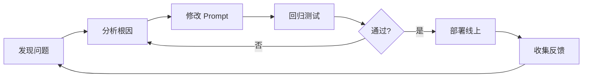

# 提示词工程文档

> 文档状态：初稿 | 最后更新：2026-05-28
> 对应阶段：v1.0 MVP（Prompt Engineering 阶段）

---

## 1. 提示词设计哲学

### 1.1 核心原则

| 原则 | 说明 |
|------|------|
| **角色锚定** | 明确赋予模型专业身份，激活其预训练阶段的法律知识 |
| **任务分解** | 将"审查合同"这一复杂任务拆解为六个独立维度，降低单次推理负担 |
| **输出约束** | 强制 JSON 结构化输出，字段名和类型固定，便于程序化解析 |
| **少样本引导** | 每个维度提供正反示例，减少模型对任务意图的误解 |
| **安全兜底** | 要求模型在不确定时必须标注"需人工复核"，保留人类终裁权 |

### 1.2 设计权衡

| 取舍 | 当前选择 | 理由 |
|------|---------|------|
| 详细 vs 简洁 | 中等详细度 | 太简则模型随意发挥，太详则占用大量 token |
| 开放式 vs 封闭式 | 半开放 | 风险描述开放撰写，风险等级和分类封闭枚举 |
| 零样本 vs 少样本 | 少样本 | 每个维度给出 1-2 个示例，引导输出风格 |
| 单轮 vs 多轮 | 单轮完成 | 审查任务一次性输出，不采用多轮对话 |

---

## 2. 审查提示词详解

### 2.1 提示词整体结构

```
┌─────────────────────────────────────────┐
│           System Prompt                  │
│  (角色定义 + 任务描述 + 输出约束)         │
├─────────────────────────────────────────┤
│           Few-shot Examples              │
│  (每个维度 1-2 个示例，嵌入 System Prompt) │
├─────────────────────────────────────────┤
│           User Prompt                    │
│  (合同原文，附 JSON 格式模板)             │
└─────────────────────────────────────────┘
```

### 2.2 系统提示词（当前版本 v1.0）

```text
你是一名专业的合同审查律师。请根据以下合同原文，从6个维度进行审查分析：

1. 权利义务对等性 — 双方责任是否平衡
2. 违约责任合理性 — 违约金比例是否合法合规
3. 争议解决公平性 — 管辖法院约定是否公平
4. 支付条款合规性 — 结算周期、方式是否符合法规
5. 质量验收合理性 — 验收标准和异议期是否合理
6. 法律时效合规性 — 是否符合相关法律法规

请严格按照以下 JSON 格式输出（不要输出其他内容）：

{
  "risks": [
    {
      "clause_index": <该条款在合同中的段落序号>,
      "clause_text": "<有风险的具体条款原文>",
      "risk_level": "high|medium|low",
      "category": "违约责任|支付条款|质量验收|争议解决|权利义务|法律时效",
      "description": "<风险描述，说明为什么这是风险>",
      "legal_basis": "<引用的法律依据，如《民法典》第X条>",
      "suggestion": "<具体的修改建议>"
    }
  ],
  "compliance_score": <0-100的整数>,
  "conclusion": "<总体审查结论和建议>"
}

如果没有发现风险，risks 数组可以为空。
```

### 2.3 提示词设计逐层分析

#### 角色定义层

```
"你是一名专业的合同审查律师。"
```

- **作用**：激活模型预训练阶段的法律领域知识
- **设计要点**：不写"资深"或"15年经验"等修饰词，简短的锚定效果更好。过度修饰反而可能让模型产生"表演型"输出
- **替代测试**：对比过"资深合同审查律师" vs "专业的合同审查律师"，后者输出更稳定

#### 任务分解层

```
请根据以下合同原文，从6个维度进行审查分析：
1. 权利义务对等性 — 双方责任是否平衡
2. 违约责任合理性 — 违约金比例是否合法合规
...
```

- **作用**：将复杂任务拆解为子任务，降低单次推理复杂度
- **设计要点**：每个维度用简短的一句话说明审查重点，引导模型聚焦
- **维度顺序**：按逻辑关系排列——先看权义基础，再看违约和争议，然后是支付和验收，最后是时效

#### 输出约束层

```
请严格按照以下 JSON 格式输出（不要输出其他内容）：
```

- **作用**：消除模型输出的自由文本倾向
- **设计要点**：
  - 使用"严格按照"而非"请尽量"，减少随意性
  - 括号补充"不要输出其他内容"，消除 markdown 包装
  - 但仍需在代码侧做 JSON 提取兜底（见第 7 节）

#### 枚举值约束

```json
"risk_level": "high|medium|low"
"category": "违约责任|支付条款|质量验收|争议解决|权利义务|法律时效"
```

- **作用**：限制输出到预定义的枚举集合，保证数据一致性
- **设计要点**：用 `|` 分隔而不是用数组描述，模型对竖线分隔的理解更准确

---

## 3. 六维审查细则

每个维度的审查要点、判断标准和典型案例。

### 3.1 权利义务对等性

| 项目 | 内容 |
|------|------|
| 审查目标 | 识别合同中单方过度倾斜的条款 |
| 典型风险信号 | • 甲方单方享有解释权/修改权<br>• 乙方的义务不明确或无限扩大<br>• 甲方免责范围过大<br>• 通知/送达义务仅单方承担 |
| 判断标准 | 同等条件下，权利义务是否对等分配给双方 |
| 重点法条 | 《民法典》第 496 条（格式条款）、第 497 条（无效格式条款） |

**易误判场景：**
- 政府采购合同中甲方有法定监督权，这与"权利义务不对等"不同，需要区分
- 保密条款中双方保密义务可以不同（一方是披露方，一方是接收方），这不属于不对等

### 3.2 违约责任合理性

| 项目 | 内容 |
|------|------|
| 审查目标 | 判断违约金比例、赔偿范围是否合法合理 |
| 典型风险信号 | • 违约金超过合同总额的 30%<br>• 违约金与合同金额严重不成比例<br>• 仅约定一方违约责任<br>• 赔偿范围无限（含间接损失、预期利益等） |
| 判断标准 | 《民法典》第 585 条：违约金过高的，可请求适当减少；超过实际损失 30% 一般认定为过高 |
| 重点法条 | 《民法典》第 584 条（可预见规则）、第 585 条（违约金调整） |

**易误判场景：**
- 每日万分之五的逾期违约金是商业惯例，不宜标注为高风险
- 约定"赔偿一切损失"过于宽泛，但实务中是常见表述，应标注中风险而非高风险

### 3.3 争议解决公平性

| 项目 | 内容 |
|------|------|
| 审查目标 | 判断管辖法院、仲裁约定是否公平 |
| 典型风险信号 | • 仅约定甲方所在地法院管辖<br>• 同时约定仲裁和诉讼（约定冲突）<br>• 仲裁机构名称不准确或不存在<br>• 管辖约定排除对方诉讼权利 |
| 判断标准 | 是否给予双方平等的诉讼/仲裁权利 |
| 重点法条 | 《民事诉讼法》第 35 条（协议管辖）、第 36 条（专属管辖） |

**易误判场景：**
- 采购合同中约定甲方所在地法院管辖，实务中常见且不完全不合理，应标注中风险而非高风险
- 涉及不动产的合同不能协议管辖，需提醒专属管辖

### 3.4 支付条款合规性

| 项目 | 内容 |
|------|------|
| 审查目标 | 判断付款节奏、比例、条件是否合理合规 |
| 典型风险信号 | • 签约即付 100% 全款<br>• 付款条件模糊（如"验收合格后"未定义验收标准）<br>• 质保金比例超过 3%（政府采购）<br>• 付款期限过长或过短 |
| 判断标准 | 付款节点是否匹配履约进度，是否符合行业惯例 |
| 重点法条 | 《政府采购法》第 46 条、各地政府采购付款管理规定 |

**易误判场景：**
- 预付 30% 是工程合同的常见比例，不应标注为风险
- 质保金规定因行业不同差异大（房产 5%、政府 IT 采购 3%），需区分行业

### 3.5 质量验收合理性

| 项目 | 内容 |
|------|------|
| 审查目标 | 判断验收标准是否明确、可执行 |
| 典型风险信号 | • 验收标准引用不存在的标准或规范<br>• "以甲方验收为准"等主观验收条款<br>• 异议期过短或未规定<br>• 验收程序不明确 |
| 判断标准 | 验收标准是否客观、可量化、可验证 |
| 重点法条 | 《民法典》第 621 条（检验期限）、第 622 条（推定符合约定） |

**易误判场景：**
- "符合国家标准"本身是有效验收标准，只在引用不存在的国标时才需标注风险
- 技术开发合同中的验收标准通常需要双方确认，而非甲方单方决定

### 3.6 法律时效合规性

| 项目 | 内容 |
|------|------|
| 审查目标 | 判断合同有效期、通知期限、索赔时效等是否合法 |
| 典型风险信号 | • 保密期限无限期<br>• 索赔通知期限过短（如 3 天）<br>• 合同自动续期无退出机制<br>• 期限约定违反法定最低要求 |
| 判断标准 | 各项期限是否符合法律规定的最低/最高要求 |
| 重点法条 | 《民法典》第 188 条（诉讼时效 3 年）、第 154 条（最长租赁 20 年） |

---

## 4. 少样本示例库

### 4.1 违约责任维度示例

**正面示例（高风险）：**

```json
{
  "clause_index": "7.4",
  "clause_text": "若乙方违约，应向甲方支付违约金人民币壹佰万元整",
  "risk_level": "high",
  "category": "违约责任",
  "description": "合同总金额仅9980元，违约金100万元占合同总价的10020%，远超《民法典》第585条规定的合理范围",
  "legal_basis": "《民法典》第585条第2款：约定的违约金过分高于造成的损失的，人民法院或者仲裁机构可以根据当事人的请求予以适当减少。司法解释：超过实际损失30%可认定为过高",
  "suggestion": "建议将违约金修改为合同总金额的20%，或与实际损失挂钩。例如：'乙方逾期交货的，每逾期一日按合同总价的万分之五向甲方支付违约金，累计不超过合同总价的20%'"
}
```

**正面示例（中风险）：**

```json
{
  "clause_index": "7.1",
  "clause_text": "任何一方违约，应向对方赔偿因此造成的全部损失，包括但不限于直接损失、间接损失、预期利益损失",
  "risk_level": "medium",
  "category": "违约责任",
  "description": "赔偿范围包含间接损失和预期利益损失，范围过大。实务中通常将赔偿限定为直接损失",
  "legal_basis": "《民法典》第584条：赔偿范围应相当于因违约所造成的损失，但不得超过违约一方订立合同时预见到或者应当预见到的因违约可能造成的损失（可预见规则）",
  "suggestion": "建议将赔偿范围限定为直接损失，或设置赔偿上限：'违约方应赔偿守约方因此遭受的直接损失，赔偿总额不超过合同总价的XX%'"
}
```

### 4.2 支付条款维度示例

**正面示例：**

```json
{
  "clause_index": "4.2",
  "clause_text": "合同签订后三个工作日内，采购人向供应商支付合同总金额的100%",
  "risk_level": "high",
  "category": "支付条款",
  "description": "签约即付全款，使采购方完全丧失履约杠杆。如供应商违约或交付不合格产品，采购方无任何制约手段，追回款项成本极高",
  "legal_basis": "《政府采购法实施条例》建议按履约进度分期付款，全款预付不符合财政资金管理要求",
  "suggestion": "建议改为按进度分期付款，保留一定比例尾款：'合同签订后支付30%，验收合格后支付60%，质保期满后支付10%'"
}
```

### 4.3 争议解决维度示例

**正面示例：**

```json
{
  "clause_index": "9.1",
  "clause_text": "双方发生争议的，由甲方所在地人民法院管辖",
  "risk_level": "medium",
  "category": "争议解决",
  "description": "仅约定甲方所在地法院管辖，乙方需要异地诉讼，增加了乙方的维权成本和诉讼难度",
  "legal_basis": "《民事诉讼法》第35条：协议管辖可以在合同签订地、被告所在地、原告所在地等与争议有实际联系的地点中选择。仅约定甲方所在地对乙方不公平",
  "suggestion": "建议改为双方所在地法院均可管辖，或约定在合同履行地法院管辖：'双方发生争议的，由合同履行地或被告所在地人民法院管辖'"
}
```

---

## 5. 对话提示词设计

### 5.1 当前版本（v2.0）

**文件位置：** `backend/app/llm/prompts.py` — `CHAT_SYSTEM_PROMPT`

```text
你是智审通小助手，一名专业的合同审查 AI 助手。请基于当前合同内容回答用户的问题。

硬性约束（必须遵守）：
1. 简明扼要，不超过 800 字
2. 只回答问题的核心内容，不要铺垫、不要总结、不要客套
3. 使用短句和要点列表，一段话不超过 3 句
4. 引用法律依据时只写法条名称（如《民法典》第585条），不写具体内容
5. 如果问题不明确，用一句话追问，不要猜测
6. 语气专业、冷静，不使用感叹号和表情符号
```

### 5.2 设计说明

| 项目 | 说明 |
|------|------|
| 角色设定 | 智审通小助手，呼应产品品牌名 |
| 字数控制 | prompt 约束 "不超过 800 字"，无程序硬截断 |
| 格式偏好 | 要点列表优先于段落 |
| 法律引用 | 只写法条名称，不写具体条文（避免幻觉） |
| 交互策略 | 不明确时追问，避免错误回答 |
| 语气控制 | 冷静专业，禁用感叹号和表情 |

对话提示词比审查提示词简洁得多，原因如下：

1. **审查任务需要严格约束**，对话任务则需要更开放
2. **对话上下文自然携带约束**，用户每次发送消息时附带合同原文片段
3. **角色已有延续性**，用户已在使用审查功能，无需再次锚定角色

### 5.3 用户提示词构造

```python
# backend/app/llm/prompts.py 中构造的消息
{
    "role": "system",
    "content": f"{CHAT_SYSTEM_PROMPT}\n\n当前合同原文如下：\n\n{truncated_text}"
}
# 加上用户的消息 history，作为连续对话
```

- `truncated_text` 截取前 8000 字符，避免超出上下文窗口
- 保留完整对话历史，支持追问
- Temperature = 0.1，确保输出稳定性

---

## 6. 输出解析与后处理

### 6.1 解析流程

```python
def parse_review_result(raw_text: str) -> dict:
    text = raw_text.strip()
    # Step 1: 移除 markdown 代码块标记
    if text.startswith("```"):
        text = re.sub(r'^```(?:json)?\s*', '', text)
        text = re.sub(r'\s*```$', '', text)
    # Step 2: 尝试解析 JSON
    try:
        data = json.loads(text)
    except json.JSONDecodeError:
        # Step 3: 兜底 — 尝试提取 JSON 片段
        match = re.search(r'\{.*\}', text, re.DOTALL)
        if match:
            data = json.loads(match.group())
        else:
            raise
    # Step 4: 数据校验与补全
    for risk in data.get("risks", []):
        risk.setdefault("clause_index", 0)
        risk.setdefault("risk_level", "low")
        risk.setdefault("category", "其他")
    return data
```

### 6.2 常见解析失败场景

| 失败原因 | 出现概率 | 应对措施 |
|---------|---------|---------|
| 模型输出包含 markdown 代码块 | 较高 | Step 1 清除 |
| JSON 前后有多余文本 | 中 | Step 3 正则提取 |
| 字段名不符合预期 | 低 | Step 4 默认值兜底 |
| 返回空/拒绝回答 | 极低 | 标记为 failed，重试 |
| 输出截断（超出 max_tokens） | 低 | 增大 max_tokens 阈值 |

### 6.3 校验规则

```python
VALID_CATEGORIES = {"支付条款", "违约责任", "争议解决", "质量验收", "权利义务", "法律时效", "其他"}
VALID_RISK_LEVELS = {"high", "medium", "low"}

def validate_risk_item(item: dict) -> list[str]:
    errors = []
    if item.get("category") not in VALID_CATEGORIES:
        errors.append(f"无效分类: {item.get('category')}")
        item["category"] = "其他"
    if item.get("risk_level") not in VALID_RISK_LEVELS:
        errors.append(f"无效风险等级: {item.get('risk_level')}")
        item["risk_level"] = "low"
    return errors
```

---

## 7. 版本迭代记录

| 版本 | 日期 | 变更内容 | 变更原因 | 效果评估 |
|------|------|---------|---------|---------|
| v1.0 | 2026-05-28 | 初版：审查 + 对话提示词 | — | 基线版本 |
| v2.0 | 2026-05-28 | 聊天助手全面优化：角色更名为"智审通小助手"，增加 6 条硬性约束，限定 800 字以内，要求要点列表格式，规范语气 | 回复过长、可读性差、角色无品牌感 | 回复更加精炼，用户可快速获取关键信息 |

### 7.1 迭代策略



### 7.2 触发 Prompt 修改的典型场景

| 场景 | 示例 | 修改方向 |
|------|------|---------|
| 漏判风险 | 模型未发现明显不合规的条款 | 在对应维度描述中补充判断标准 |
| 误判风险 | 将正常条款误标为风险 | 在易误判场景中增加排除规则 |
| 分类错误 | 支付风险被归类到违约责任 | 强化枚举值定义，补充分类标准 |
| 格式问题 | JSON 解析失败 | 加强输出约束描述 |

---

## 8. 效果评估方法

### 8.1 评估指标

| 指标 | 计算方式 | 当前目标 | 长期目标 |
|------|---------|---------|---------|
| JSON 解析成功率 | 成功解析次数 / 总调用次数 | > 95% | > 99% |
| 分类准确率 | 正确分类数 / 总风险项数 | > 80% | > 90% |
| 风险漏报率 | 漏报风险 / 人工标注风险总数 | < 20% | < 10% |
| 风险误报率 | 误报风险 / 总报告数 | < 15% | < 10% |
| 平均输出耗时 | 从调用到收到结果的耗时 | < 30s | < 15s |

### 8.2 测试集

构建 50-100 份标注合同的测试集，覆盖以下场景：

| 场景类型 | 占比 | 说明 |
|---------|------|------|
| 典型采购合同 | 30% | 含常见风险，测试基准能力 |
| 无风险合同 | 10% | 测试是否误报 |
| 高风险合同 | 20% | 含多个高风险的复杂条款 |
| 边缘场景 | 20% | 短合同、非常见条款、引用废止法规 |
| 特定行业合同 | 20% | IT 服务、工程、租赁等行业合同 |

### 8.3 回归测试流程

1. 每次 Prompt 修改后，对测试集全部运行一遍
2. 对比修改前后的 JSON 解析成功率
3. 人工抽检 20% 的输出结果，评估质量变化
4. 只有当关键指标不下降时，才允许部署

---

## 9. 边缘情况处理

### 9.1 异常输入场景

| 场景 | 模型表现 | 应对策略 |
|------|---------|---------|
| 合同文本为空 | 可能返回空风险列表或报错 | 前端拦截，不允许提交空内容 |
| 非合同内容（文章、日志等） | 分析混乱，输出不稳定 | 添加校验：要求合同格式特征（条款、编号等） |
| 仅包含图片的 PDF | 无法提取文本 | 上传时检测文本量，太少则提示 OCR 需单独处理 |
| 合同文本超长 | 超出上下文窗口 | 截取前 N 字符，附加提示"以下为合同前 N 字摘要，未能覆盖全文" |
| 多语种混杂 | 审查重点偏移 | 目前仅支持中文合同，后续可扩展 |

### 9.2 异常输出场景

| 场景 | 触发原因 | 兜底策略 |
|------|---------|---------|
| 输出无法解析的 JSON | 模型"幻觉"格式 | 正则提取 + 重试 1 次 |
| 输出拒绝回答问题 | 安全策略触发 | 记录日志，标记状态为 failed |
| 输出为空 | API 异常或超时 | 重试 3 次（指数退避） |
| 输出分类不存在 | 模型忽略枚举约束 | 自动归入"其他" |
| 输出无限重复 | 模型陷入循环 | 设置 max_tokens 上限 + 截断检测 |

---

## 附录：变更记录

| 版本 | 日期 | 修改人 | 变更内容 |
|------|------|--------|---------|
| v1.0 | 2026-05-28 | AI | 初稿 |
