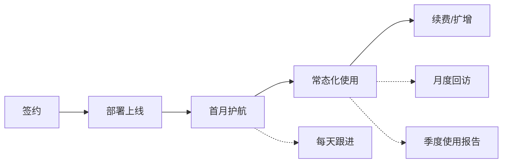

# 运营推广方案

> 文档状态：初稿 | 最后更新：2026-05-28

---

## 1. 市场进入策略

### 1.1 目标市场分层

```
第一梯队（首发突破）
┌─────────────────────────────────────────────┐
│  区县级政府机关 & 事业单位                     │
│  客户画像：年合同量 50-200 份                  │
│  预算范围：3-10 万元                          │
│  决策周期：2-4 个月                           │
│  核心诉求：满足审计要求、提升审查效率           │
└─────────────────────────────────────────────┘
              ↓
第二梯队（规模复制）
┌─────────────────────────────────────────────┐
│  市级政府机关 & 国央企法务部门                 │
│  客户画像：年合同量 200-2000+ 份              │
│  预算范围：10-30 万元                         │
│  决策周期：4-8 个月                           │
│  核心诉求：标准化审查体系、全流程留痕           │
└─────────────────────────────────────────────┘
              ↓
第三梯队（生态扩展）
┌─────────────────────────────────────────────┐
│  国央企法务部门                              │
│  客户画像：年合同量 500-2000+ 份             │
│  定价模式：企业版 / 本地化部署               │
│  核心诉求：标准化审查体系、全流程留痕         │
└─────────────────────────────────────────────┘
```

### 1.2 城市分级推进计划

| 阶段 | 目标城市 | 策略 | 时间 |
|------|---------|------|------|
| 试点期 | 成都、武汉、西安等 2-3 个二线城市 | 集中资源打标杆，每个城市攻 1-2 个客户 | 第 1-3 月 |
| 复制期 | 扩展至 10-15 个城市 | 标杆客户背书 + 渠道代理模式 | 第 4-8 月 |
| 规模期 | 全国主要城市覆盖 | 品牌效应 + 政府采购平台入围 | 第 9-12 月 |

> 选择二线城市而非一线城市的原因：一线城市供应商体系成熟、竞争激烈；二线城市政府数字化转型需求强、预算灵活、决策链相对较短。

---

## 2. 客户获取渠道

### 2.1 渠道矩阵

| 渠道类型 | 具体渠道 | 获客成本 | 转化周期 | 优先级 |
|---------|---------|---------|---------|--------|
| **政府采购平台** | 各省市政府采购网（入围上架） | 中 | 2-4 月 | P0 |
| **行业协会** | 数字政府促进会、法学会、招标投标协会 | 低 | 1-3 月 | P0 |
| **渠道合作伙伴** | OA 厂商（致远、泛微）、系统集成商 | 中 | 2-6 月 | P0 |
| **行业会议** | 数字政府峰会、法律科技论坛 | 高 | 1-2 月 | P1 |
| **线上内容营销** | 知乎、公众号、行业媒体 | 低 | 3-6 月 | P1 |
| **直接拜访** | 政府办公室/法规科定向拜访 | 高 | 1-3 月 | P1 |

### 2.2 政府采购平台入驻路径

```
准备阶段
┌─────────────────────────────────────────────┐
│  1. 完成软件著作权登记（2-4 周）               │
│  2. 完成信息安全等级保护（等保二级，4-8 周）    │
│  3. 准备产品介绍、报价单、案例集               │
└─────────────────────────────────────────────┘
              ↓
申报阶段
┌─────────────────────────────────────────────┐
│  1. 注册政府采购网供应商账号                   │
│  2. 提交产品资料和资质文件                     │
│  3. 等待审核公示（2-4 周）                     │
└─────────────────────────────────────────────┘
              ↓
运营阶段
┌─────────────────────────────────────────────┐
│  1. 关注采购公告，主动应答                     │
│  2. 提供免费试用账号，降低采购方决策门槛        │
│  3. 积累成交记录，提升平台评分                  │
└─────────────────────────────────────────────┘
```

### 2.3 渠道伙伴合作模式

| 合作模式 | 分成比例 | 适用伙伴 | 说明 |
|---------|---------|---------|------|
| 项目转售 | 渠道 20-30% | 系统集成商 | 伙伴在项目中带入产品，负责客户关系，我们负责交付 |
| 贴牌 OEM | 渠道 40-50% | OA 厂商 | 产品嵌入伙伴平台，以伙伴品牌交付 |
| 代理分销 | 阶梯折扣 | 区域代理商 | 按年度采购量给予折扣，代理商自主销售 |

---

## 3. 定价策略

### 3.1 定价模式

```
SaaS 订阅制（标准化）
├── 专业版 ¥9,800/年
│   ├── 100 份合同审查/年
│   ├── AI 对话助手
│   ├── 完整报告导出
│   └── 适用场景：区县级机关事业单位
│
├── 企业版 ¥29,800/年
│   ├── 500 份合同审查/年
│   ├── 全部功能（含仪表盘、AI 对话）
│   ├── 专属客服
│   └── 适用场景：市级机关、国央企

本地化部署（私有化）
├── 基础部署 ¥58,000（一次性）
│   ├── 软件授权（永久有效）
│   ├── AI 审查额度：1,000 份/年
│   ├── 不含服务器
│   └── 年度维护费：¥9,800/年（含更新+支持）
│
├── 完整部署 ¥98,000（一次性）
│   ├── 软件授权 + 模型私有化部署
│   ├── AI 审查额度：不限量
│   ├── 等保三级适配支持
│   └── 年度维护费：¥16,800/年（含更新+支持）
```

### 3.2 定价依据

| 版本 | 年化价值测算 | 定价逻辑 |
|------|------------|---------|
| 专业版 ¥9,800 | 用户 ROI ≈ 4x | 定价为客户年化价值的 25%，便于通过政府采购审批 |
| 企业版 ¥29,800 | 用户 ROI ≈ 3x | 功能更全，价值更高，定价仍远低于人工成本 |
| 本地化部署 ¥58,000 | 2 年回本 | 一次性授权，后续维护费仅含 17% |

### 3.3 定价对比（竞品参照）

| 产品 | 年费范围 | 定位差异 |
|------|---------|---------|
| 幂律智能 | ¥50,000-200,000 | 面向大型企业，功能重，定制化强 |
| 法天使 | ¥3,000-30,000 | 模板为主，AI 审查为增值模块 |
| 传统合同管理 SaaS | ¥10,000-50,000 | 流程管理为主，AI 审查能力弱 |
| **本产品** | **¥9,800-29,800** | **轻量级 AI 原生审查工具，性价比突出** |

---

## 4. 内容营销与品牌建设

### 4.1 内容矩阵

| 内容类型 | 发布渠道 | 频次 | 目的 |
|---------|---------|------|------|
| **案例研究** | 官网、公众号 | 每月 1 篇 | 展示客户成功故事，建立信任 |
| **行业洞察** | 知乎、行业媒体 | 每两周 1 篇 | 建立 AI+法律领域专业形象 |
| **产品更新** | 公众号、用户群 | 版本发布时 | 让用户感知产品持续迭代 |
| **操作指南** | 官网帮助中心 | 随功能同步 | 降低用户上手成本 |
| **合规解读** | 公众号、视频号 | 节假日/政策发布时 | 蹭热点导流，吸引目标用户 |

### 4.2 标杆案例包装

**案例结构：**

```
标题：XX 区/单位用 AI 合同审查后，审查效率提升 XX%

一、基本信息
  客户：XX 市 XX 局 | 合同类型：政府采购 | 使用时间：X 个月

二、使用前的问题
  - 合同审查周期：3-5 天/份
  - 退回率：40%+
  - 法务人员工作量饱和

三、使用后的效果
  | 指标 | 使用前 | 使用后 |
  |------|--------|--------|
  | 平均审查周期 | 3.5 天 | 0.5 天 |
  | 退回修改率 | 42% | 15% |
  | 法务效率 | — | 提升 60% |

四、用户评价（直接引用客户原话）
  "AI 帮我们把 80% 的重复性审查工作做了，法务只需要复核高风险项。"

五、产品功能对应
  - AI 自动审查 → 5 分钟完成初筛
  - 风险标注 → 快速定位问题条款
  - 报告导出 → 审计材料一键准备
```

### 4.3 SEO 关键词策略

| 关键词类型 | 示例 | 搜索意图 | 优先级 |
|-----------|------|---------|--------|
| 品牌词 | AI 合同审查、智能合同审查 | 有明确采购意向 | P0 |
| 需求词 | 合同审查工具、合同风险检测 | 寻找解决方案 | P0 |
| 场景词 | 政府采购合同审查、事业单位合同管理 | 场景化需求 | P1 |
| 痛点词 | 合同审查效率低、合同风险排查 | 被动搜索，教育市场 | P1 |
| 政策词 | 信创替代、等保合规、数字政府 | 政策驱动的采购需求 | P2 |

---

## 5. 销售转化流程

### 5.1 转化漏斗

```
认知              触达人数
 │   线上内容触达 + 渠道推广
 ▼
兴趣              留资率 5-10%
 │   免费试用申请
 ▼
试用              转化率 20-30%
 │   5 次免费审查额度用完
 ▼
意向              意向率 40-50%
 │   主动询价 / 申请演示
 ▼
报价              成交率 30-40%
 │   正式报价 + 商务谈判
 ▼
成交
```

### 5.2 关键转化节点设计

| 节点 | 用户动作 | 我们的动作 | 工具 |
|------|---------|-----------|------|
| **免费试用** | 注册→上传合同→获取审查结果 | 引导用户完成首次审查全流程 | 产品内新手引导 |
| **额度用完** | 体验结束，需要续费/购买 | 发送邮件：使用报告 + 购买建议 | 自动化邮件 |
| **申请演示** | 联系销售团队 | 24h 内响应，安排 30 分钟在线演示 | CRM 系统 |
| **报价阶段** | 内部评估、预算申请 | 协助准备采购材料（参数、报价、案例） | 销售素材包 |
| **POC 测试** | 要求实际测试 | 提供专属测试环境 + 测试合同样本 | 独立部署环境 |

### 5.3 销售素材清单

| 素材 | 用途 | 状态 |
|------|------|------|
| 产品介绍 PPT | 当面演示、会议展示 | 待制作 |
| 技术方案书 | 应标、POC 测试 | ✅ 已存在（docs/05） |
| 功能清单对比 | 竞品对比、价值陈述 | 待制作 |
| 客户案例集 | 建立信任、行业参考 | 第一单后制作 |
| 采购参数模板 | 客户写采购需求时直接参考 | 待制作 |
| 报价单模板 | 商务阶段 | 待制作 |
| 产品操作手册 | 客户上手使用 | 待制作 |
| SaaS 使用协议 | 法律合规 | 待制作 |

---

## 6. 客户成功与留存

### 6.1 客户生命周期管理



| 阶段 | 时间 | 关键动作 | 成功标准 |
|------|------|---------|---------|
| 部署上线 | 1-3 天 | 环境配置、数据迁移、人员培训 | 首份合同审查完成 |
| 首月护航 | 第 1 个月 | 每周回访、问题解答、使用数据分析 | 月审查量 > 20 份 |
| 常态化使用 | 第 2-6 个月 | 月度回访、功能更新通知、季度报告 | 续费率 > 85% |
| 续费/扩增 | 第 6-12 个月 | 价值回顾、扩增场景挖掘 | 续约 + 增购率 > 70% |

### 6.2 客户流失预警

| 预警信号 | 触发条件 | 干预措施 |
|---------|---------|---------|
| 活跃度骤降 | 连续 2 周无审查活动 | 发送关怀邮件，主动电话回访 |
| 审查量锐减 | 月度审查量下降 > 50% | 了解原因，提供使用建议 |
| 负面反馈 | 审查结果多次不满意 | 分析问题，优化 Prompt，客户致歉 |
| 关键人变动 | 对接法务/办公室人员离职 | 重新拜访，对接新人，重新培训 |
| 合同到期前 60 天 | 租期剩余 60 天前未联系 | 发送续费提醒 + 使用报告 |

### 6.3 NPS 提升策略

| 阶段 | 目标 NPS | 关键动作 |
|------|---------|---------|
| 签约后 1 个月 | > 40 | 确保部署顺利，现场培训 |
| 签约后 3 个月 | > 50 | 主动分享使用技巧和最佳实践 |
| 签约后 6 个月 | > 60 | 邀请参加用户交流会，反馈产品路线图 |

---

## 7. 团队与预算

### 7.1 推广阶段人员配置

| 角色 | 试点期 (1-3月) | 复制期 (4-8月) | 规模期 (9-12月) |
|------|:---:|:---:|:---:|
| 产品/技术 | 2 人（现有） | 3-4 人 | 5-6 人 |
| 销售/市场 | 1 人 | 2-3 人 | 4-5 人 |
| 客户成功 | 兼职 | 1 人 | 2 人 |
| **合计** | **3 人** | **6-8 人** | **11-13 人** |

### 7.2 推广预算估算

| 项目 | 试点期（万元） | 复制期（万元） | 规模期（万元） |
|------|:---:|:---:|:---:|
| 行业会议参会 | 1-2 | 3-5 | 5-8 |
| 线上广告投放 | 0 | 2-3 | 5-10 |
| 内容制作 | 1 | 2-3 | 3-5 |
| 合作伙伴佣金 | 0（尚无伙伴） | 3-5 | 8-15 |
| 销售人工成本 | 3-5 | 6-10 | 12-18 |
| 客户成功 | 0 | 2-3 | 4-6 |
| 等保/软著资质 | 2-3 | 0 | 0 |
| **合计** | **7-11** | **18-29** | **37-62** |

### 7.3 收入预测（保守估计）

| 月份 | 新客户数 | 平均客单价 | 月新增收入 | 累计收入 |
|:---:|:---:|:---:|:---:|:---:|
| 第 1 月 | 0（内部准备） | — | — | — |
| 第 2 月 | 1（种子用户免费） | ¥0 | ¥0 | ¥0 |
| 第 3 月 | 1 | ¥9,800 | ¥9,800 | ¥9,800 |
| 第 4 月 | 2 | ¥9,800 | ¥19,600 | ¥29,400 |
| 第 5 月 | 2 | ¥15,000 | ¥30,000 | ¥59,400 |
| 第 6 月 | 3 | ¥15,000 | ¥45,000 | ¥104,400 |
| 第 7 月 | 4 | ¥15,000 | ¥60,000 | ¥164,400 |
| 第 8 月 | 5 | ¥20,000 | ¥100,000 | ¥264,400 |
| 第 9 月 | 5 | ¥20,000 | ¥100,000 | ¥364,400 |
| 第 10 月 | 6 | ¥20,000 | ¥120,000 | ¥484,400 |
| 第 11 月 | 6 | ¥25,000 | ¥150,000 | ¥634,400 |
| 第 12 月 | 8 | ¥25,000 | ¥200,000 | ¥834,400 |

---

## 8. 关键里程碑与 KPI

### 8.1 里程碑

| 时间 | 里程碑 | 交付物 |
|------|--------|--------|
| 第 1 月 | 完成资质准备 | 软著申请、等保测评启动 |
| 第 2 月 | 首个种子客户上线 | 标杆案例初稿 |
| 第 3 月 | 入围首批政府采购平台 | 平台供应商账号激活 |
| 第 4 月 | 发展首个渠道伙伴 | 渠道合作协议签署 |
| 第 6 月 | 累计 10 家付费客户 | 客户案例集（2-3 篇） |
| 第 9 月 | 累计 25 家付费客户 | 进入 5 个省级采购平台 |
| 第 12 月 | 累计 50 家付费客户 | 年收入突破 80 万 |

### 8.2 核心 KPI

| KPI | 目标值 | 计算方式 |
|-----|--------|---------|
| 客户数量 | 50 家/年 | 签约付费客户 |
| 客户续费率 | > 85% | 到期续约客户 / 到期应续客户 |
| 客户获取成本 | < ¥15,000 | 销售市场总投入 / 新客户数 |
| 平均客单价 | > ¥18,000 | 总收入 / 客户总数 |
| 免费→付费转化率 | > 25% | 付费客户 / 试用注册用户 |
| 客户首月活跃率 | > 80% | 首月审查量 > 5 份的用户 / 新用户 |
| NPS | > 50 | 客户净推荐值调研 |

---

## 9. 风险与应对

| 风险 | 概率 | 影响 | 应对措施 |
|------|:---:|:---:|---------|
| 政府客户决策周期过长 | 高 | 高 | 同时拓展国央企、高校，缓解现金流压力 |
| 竞品低价竞争 | 中 | 高 | 聚焦政府行业 Know-how，不陷入价格战 |
| 产品审查质量未达预期 | 中 | 高 | 快速迭代 Prompt，建立人工复核兜底机制 |
| 等保/软著办理延迟 | 中 | 中 | 提前启动资质办理，预留缓冲期 |
| 销售人员招聘困难 | 低 | 中 | 兼职/渠道模式先行，验证后再建团队 |
| 政府预算收紧 | 中 | 中 | 提供免费版积累用户，政策回暖后再转化 |

---

## 附录：变更记录

| 版本 | 日期 | 修改人 | 变更内容 |
|------|------|--------|---------|
| v1.0 | 2026-05-28 | AI | 初稿 |

## 参考文献

[^1]: 陕西师范大学.《AI可以辅助审核小额零星采购合同》. 2025. AI 辅助后审核准确率从 50% 提升至 80%+.
